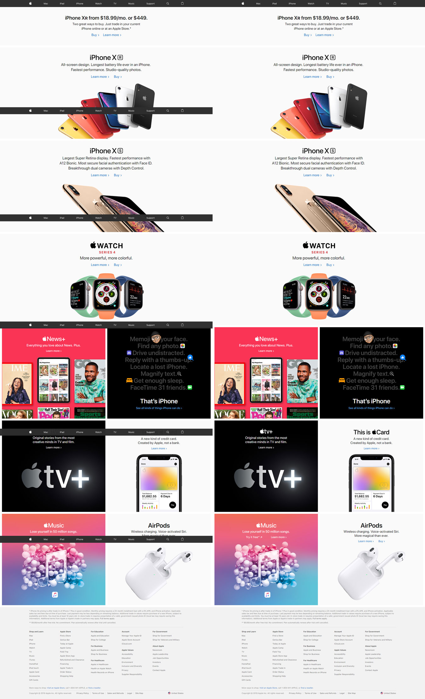

We are pleased to announce that we now have a new Visual Regression service for WebdriverIO V5 called `wdio-image-comparison-service`.

## What can it do?
*wdio-image-comparison-service* is a lightweight *WebdriverIO* service for browsers / mobile browsers / hybrid apps to do image comparison on screens, elements or full page screens.

You can:

- save or compare screens / elements / full page screens against a baseline
- automatically create a baseline when no baseline is there
- blockout custom regions and even automatically exclude a status and or tool bars (mobile only) during a comparison
- increase the element dimensions screenshots
- use different comparison methods
- and much more, see the [options here](https://github.com/wswebcreation/wdio-image-comparison-service/blob/master/docs/OPTIONS.md)

The module is now based on the power of the new [`webdriver-image-comparison`](https://github.com/wswebcreation/webdriver-image-comparison) module. This is a lightweight module to retrieve the needed data and screenshots for all browsers / devices.
The comparison power comes from [ResembleJS](https://github.com/Huddle/Resemble.js). If you want to compare images online you can check the [online tool](https://rsmbl.github.io/Resemble.js/).


It can be used for:

- desktop browsers (Chrome / Firefox / Safari / Internet Explorer 11 / Microsoft Edge)
- mobile / tablet browsers (Chrome / Safari on emulators / real devices) via Appium
- Hybrid apps via Appium

For versions check below:

[](https://eu-central-1.saucelabs.com/u/wdio-image-comparison-service)

## Installation
Install this module locally with the following command to be used as a (dev-)dependency:

```bash npm2yarn
npm install --save-dev wdio-image-comparison-service
```

Instructions on how to install `WebdriverIO` can be found [here.](http://webdriver.io/guide/getstarted/install.html)

## Usage
> ***wdio-image-comparison-service* supports NodeJS 8 or higher**

### Configuration
`wdio-image-comparison-service` is a service so it can be used as a normal service. You can set it up in your `wdio.conf.js` file with the following:

```js
const { join } = require('path');

// wdio.conf.js
exports.config = {
    // ...
    // =====
    // Setup
    // =====
    services: [
        ['image-comparison',
        // The options
        {
            // Some options, see the docs for more
            baselineFolder: join(process.cwd(), './tests/sauceLabsBaseline/'),
            formatImageName: '{tag}-{logName}-{width}x{height}',
            screenshotPath: join(process.cwd(), '.tmp/'),
            savePerInstance: true,
            autoSaveBaseline: true,
            blockOutStatusBar: true,
            blockOutToolBar: true,
            // ... more options
        }],
    ],
    // ...
};
```

More plugin options can be found [here](https://github.com/wswebcreation/wdio-image-comparison-service/blob/master/docs/OPTIONS.md#plugin-options).

### Writing tests
*wdio-image-comparison-service* is framework agnostic, meaning that you can use it with all the frameworks WebdriverIO supports like `Jasmine|Mocha`.
You can use it like this:

```js
describe('Example', () => {
  beforeEach(() => {
     browser.url('https://webdriver.io');
  });

  it('should save some screenshots', () => {
  	// Save a screen
  	browser.saveScreen('examplePaged', { /* some options*/ });

  	// Save an element
  	browser.saveElement($('#element-id'), 'firstButtonElement', { /* some options*/ });

  	// Save a full page screens
  	browser.saveFullPageScreen('fullPage', { /* some options*/ });
  });

  it('should compare successful with a baseline', () => {
  	// Check a screen
  	expect(browser.checkScreen('examplePaged', { /* some options*/ })).toEqual(0);

  	// Check an element
  	expect(browser.checkElement($('#element-id'), 'firstButtonElement', { /* some options*/ })).toEqual(0);

  	// Check a full page screens
  	expect(browser.checkFullPageScreen('fullPage', { /* some options*/ })).toEqual(0);
  });
});
```

**If you run for the first time without having a baseline the `check`-methods will reject the promise with the following warning:**

```sh
#####################################################################################
 Baseline image not found, save the actual image manually to the baseline.
 The image can be found here:
 /Users/wswebcreation/Git/wdio-image-comparison-service/.tmp/actual/desktop_chrome/examplePage-chrome-latest-1366x768.png
 If you want the module to auto save a non existing image to the baseline you
 can provide 'autoSaveBaseline: true' to the options.
#####################################################################################

```

This means that the current screenshot is saved in the actual folder and you **manually need to copy it to your baseline**.
If you instantiate `wdio-image-comparison-service` with `autoSaveBaseline: true` the image will automatically be saved into the baseline folder.

### Nice new feature
When you create a fullpage screenshot you might have some elements that stay in the view, like a stickyheader or a chatbox.
These elements normally mess up the screenshot like you can see on the left side of the below image.

But you can now add elements that need to be hidden after the first scroll which will give you a result as you can see in the right side of the below image.
This can be done by adding this property to your test:

```js
browser.checkFullPageScreen('fullPage', {
    hideAfterFirstScroll: [
        $('nav-bar'),
        $('chat-box'),
    ],
});
```




### Test result outputs
The `save(Screen/Element/FullPageScreen)` methods will provide the following information after the method has been executed:

```js
const saveResult = {
  // The device pixel ratio of the instance that has run
  devicePixelRatio: 1,
  // The formatted filename, this depends on the options `formatImageName`
  fileName: 'examplePage-chrome-latest-1366x768.png',
  // The path where the actual screenshot file can be found
  path: '/Users/wswebcreation/Git/wdio-image-comparison-service/.tmp/actual/desktop_chrome',
};
```

See the [Save output](https://github.com/wswebcreation/wdio-image-comparison-service/blob/master/docs/OUTPUT.md#save-output) section in the [output](https://github.com/wswebcreation/wdio-image-comparison-service/blob/master/docs/OUTPUT.md) docs for the images.

By default the `check(Screen/Element/FullPageScreen)` methods will only provide a mismatch percentage like `1.23`, but when the plugin has the options `returnAllCompareData: true` the following information is provided after the method has been executed:

```js
const checkResult = {
  // The formatted filename, this depends on the options `formatImageName`
  fileName: 'examplePage-chrome-headless-latest-1366x768.png',
  folders: {
      // The actual folder and the file name
      actual: '/Users/wswebcreation/Git/wdio-image-comparison-service/.tmp/actual/desktop_chrome/examplePage-chrome-headless-latest-1366x768.png',
      // The baseline folder and the file name
      baseline: '/Users/wswebcreation/Git/wdio-image-comparison-service/localBaseline/desktop_chrome/examplePage-chrome-headless-latest-1366x768.png',
      // This following folder is optional and only if there is a mismatch
      // The folder that holds the diffs and the file name
      diff: '/Users/wswebcreation/Git/wdio-image-comparison-service/.tmp/diff/desktop_chrome/examplePage-chrome-headless-latest-1366x768.png',
    },
    // The mismatch percentage
    misMatchPercentage: 2.34
};
```

See the [Check output on failure](https://github.com/wswebcreation/wdio-image-comparison-service/blob/master/docs/OUTPUT.md#check-output-on-failure) section in the [output](https://github.com/wswebcreation/wdio-image-comparison-service/blob/master/docs/OUTPUT.md) docs for the images.

# Support
If you need support you can help in the community [Matrix](https://matrix.to/#/#webdriver.io:gitter.im) channel.

Happy testing!

Grtz,

The Blue Guy
