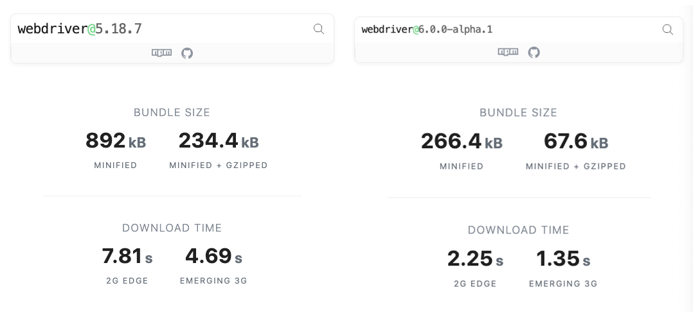
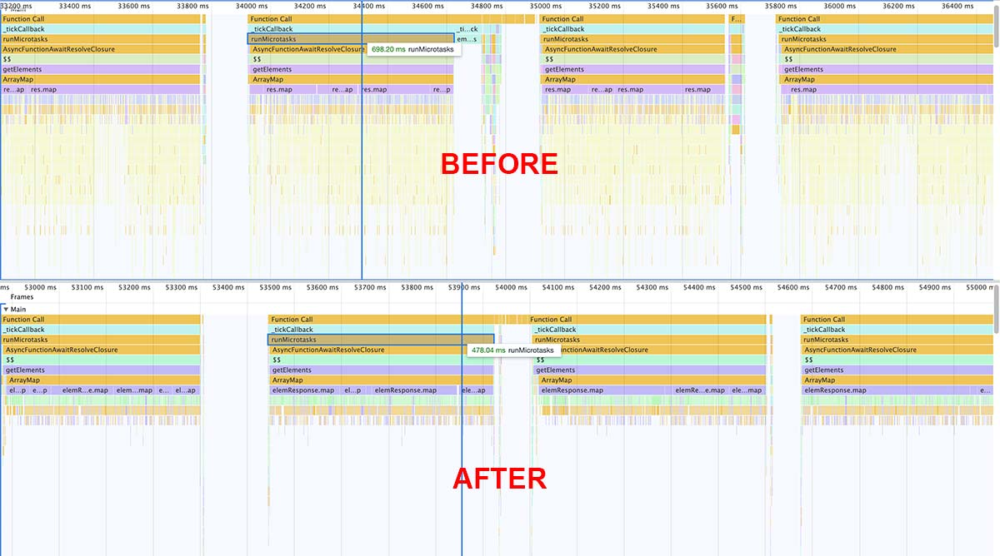

If you read this and are already about to freak out because you just spent a lot of time migrating to v5, don't worry! This major update is far less "breaking" than the one last year. While all the architectural changes last year left us no choice to break a lot of things, we were very careful this time and made sure that upgrading the framework won't become a big task.

This major update is much more reasonable and contains subtle changes that will help the project further grow while remaining performant at the same time. This blog post will go into details about all major changes and will explain what you need to do to transition from v5 to the v6.

## Drop Node v8 Support

We've dropped support for Node v8, which was deprecated by the Node.js team at the start of 2020. It is not recommended to run any systems using that version anymore. We strongly advise to switch to Node v12 which will be supported until April 2022.

### How to Update?

To update Node.js, it is important to know how it was installed in the first place. If you are in a Docker environment, you can just upgrade the base image like:

```git
- FROM mhart/alpine-node:8
+ FROM mhart/alpine-node:12
```

We recommend using [NVM](https://github.com/nvm-sh/nvm) (Node Version Manager) to install and manage Node.js versions. You can find a detailed description on how to install NVM and update Node in their [project readme](https://github.com/nvm-sh/nvm#installing-and-updating).

## `devtools` Automation Protocol is now Default

Because of the great success of automation tools like [Puppeteer](https://pptr.dev/) and [Cypress.io](https://www.cypress.io/) it became obvious that the [WebDriver](https://w3c.github.io/webdriver/) protocol in its current shape and form doesn't meet the requirements of todays developer and automation engineers. Members of the WebdriverIO project are part of the [W3C Working Group](https://www.w3.org/testing/browser/) that defines the WebDriver specification and they work together with browser vendors on solutions to improve the current state of the art. Thanks to folks from Microsoft there already proposals about a new [bidirectional connection](https://github.com/MicrosoftEdge/MSEdgeExplainers/tree/master/WebDriverRPC) similar to other automation protocols like [Chrome Devtools](https://chromedevtools.github.io/devtools-protocol/).

Until we have reached consensus between all browser vendors on the new WebDriver architecture, the project wants to offer alternative solutions. This is why we've started to support Puppeteer natively using the same APIs. We already announced support for it [last year](https://webdriver.io/blog/2019/09/16/devtools.html) and have now fully embed it into the project. This means that to run a local test script you won't need to download a browser driver anymore. WebdriverIO checks if a browser driver is running and accessible at `localhost:4444/` and uses Puppeteer as fallback if not. If you use the WebdriverIO API the experience using WebDriver vs Puppeteer should be the same, running commands on Puppeteer might even be a little faster.

> __Note:__ using Puppeteer instead of WebDriver is only supported if running tests locally and if the browser is located on the same machine as the tests.

Being able to access Puppeteer in your tests allows you to leverage the capabilities of the Chrome DevTools protocol which has a much richer set of automation features. In your tests you are free to switch between Puppeteer and WebdriverIO API as you wish, e.g.:

```js
describe('my e2e tests', () => {
    // ...

    it('replaces the WebdriverIO logo with the Puppeteer logo', () => {
        browser.url('https://webdriver.io')

        /**
         * run Puppeteer code with promises to intercept network requests
         * and replace the WebdriverIO logo in the docs with the Puppeteer logo
         */
        const wdioLogo = 'webdriverio.png'
        const pptrLogo = 'https://user-images.githubusercontent.com/10379601/29446482-04f7036a-841f-11e7-9872-91d1fc2ea683.png'
        browser.call(async () => {
            const puppeteerBrowser = browser.getPuppeteer()
            const page = (await puppeteerBrowser.pages())[0]
            await page.setRequestInterception(true)
            page.on('request', (interceptedRequest) => (
                interceptedRequest.url().endsWith(wdioLogo)
                    ? interceptedRequest.continue({ url: pptrLogo })
                    : interceptedRequest.continue()
            ))
        })

        // continue with sync WebdriverIO commands
        browser.refresh()
        browser.pause(2000)
    })

})
```

We have integrated Puppeteer so you can run "cross browser" tests on Chrome, Firefox (Nightly) and Chromium Edge. Note that the term cross browser is used with quotation marks here. A lot of automation tools today advertise their cross browser support while not being really honest about what it actually means. All Chromium based browser like Google Chrome, Chromium Edge or Electron based apps use the identical engine under the hood. It is questionable that there is much value testing on multiple Chromium based browser. In addition to that the support for Firefox is and will be experimental as it was implemented in an ad-hoc effort by a team at Mozilla which hasn't committed to bring it out of its experimental state and continue support for it.

We have not planned to integrate [Playwright](https://github.com/microsoft/playwright) as we can not affort to download their custom build browsers every time someone installs WebdriverIO. We will observe its development and might consider an integration at some point.

The WebdriverIO team wants to emphasize that it continues to be invested in WebDriver as an automation standard which is till today the only true cross browser automation protocol. We will always prefer a standards based solution that has been developed by a diverse group of people representing the industry at large.

### How to Update?

If you are running your tests on WebDriver already, nothing needs to be changed. WebdriverIO will only fallback to Puppeteer if it can't find a browser driver running.

## Performance Improvements

A big goal with the new release was to make WebdriverIO more performant and faster. Running tests on Puppeteer can already speed up your local execution. But we also looked into other areas to improve. With v6 we replaced our heavy dependency to [`request`](https://github.com/request/request) which has been fully depcrecated as off February 11th 2020. With that we were able to reduce the bundle size of the `webdriver` and `webdriverio` package by 4x:



By using [`got`](https://github.com/sindresorhus/got) as new dependency to make requests in WebDriver we are now technically also able to run WebdriverIO in the browser which creates interesting possibilities and was a requirement for our [roadmap item](https://github.com/webdriverio/webdriverio/blob/master/ROADMAP.md#upcoming-projects-in-no-particular-order) to build a fiddle platform for WebdriverIO scripts.

The new version v6 will also come with a lot of internal improvements that will speed up test execution and lower CPU and memory usage. Especially when it comes to fetching elements we were able to reduce a lot of overhead and spead things up:



### How to Update?

These improvements come for free and you don't need to do anything to better performance in v6 when upgrading.

## Service Configurations

We are very proud about the amount of different [services](https://www.npmjs.com/search?q=wdio-service) and [reporters](https://www.npmjs.com/search?q=wdio-reporter) that the community built. All these additional plugins require specific configurations in your `wdio.conf.js` and we want to make sure that all these settings are being made standardised structure. Until v5 of WebdriverIO specific options to services and reporters could be defined anywhere in the `wdio.conf.js`, e.g. the Sauce service:

```js
// wdio.conf.js
export.config = {
  // ...
  services: ['sauce'],
  user: process.env.SAUCE_USERNAME,
  key: process.env.SAUCE_ACCESS_KEY,
  region: 'us',
  sauceConnect: true,
  // ...
};
```

With v6 we moved all configurations into the services list close to where the service is actually defined. This will help to maintain a clear structure in the config file while at the same time keep the set of different "native" supported configurations clear. In v6 the example above needs to be modified as to become this:

```js
// wdio.conf.js
export.config = {
    // ...
    user: process.env.SAUCE_USERNAME,
    key: process.env.SAUCE_ACCESS_KEY,
    region: 'us', // WebdriverIO Configuration
    services: [
        ['sauce', {
            sauceConnect: true, // @wdio/sauce-service configuration
            sauceConnectOpts: { // @wdio/sauce-service configuration
                // ...
            }
        }]
    ],
    // ...
};
```

As part of this effort we also looked into the service option names and renamed to be more short and precise.

### How to Update?

Walk through your WDIO configuration files and look for configurations that are not specifically defined by as WebDriver or WDIO [options](https://webdriver.io/docs/options.html). These needs to be moved into the service list according to the example above. In addition to that have a look if option names have changed and update them accordingly.

## Command Interface Changes

In the past we have been adding a lot of additional functionality into single commands like click to serve different purposes. This new functionality could be used by applying parameters to the command. Unfortunately the amount of such parameters has grown and caused a lot of confusion and made some commands not readable anymore. If you ever had to use `$('#elem').waitForExist(null, null true)` to wait until an element does __not__ exist anymore you will know how bad things have become.

With v6 we have changed the structure of a couple of commands to allow named parameters instead. With that the code becomes much more readable and allows better type enforcement when using TypeScript. The above example looks in v6 as follows:

```js
$('#elem').waitForExist({ reverse: true })
```

### How to Update?

We have changed the structure of the following commands:

- affected `browser` methods:
    - [newWindow](https://webdriver.io/docs/api/browser/newWindow.html)
    - [react$](https://webdriver.io/docs/api/browser/react$.html)
    - [react$$](https://webdriver.io/docs/api/browser/react$$.html)
    - [waitUntil](https://webdriver.io/docs/api/browser/waitUntil.html)

- affected element methods:
    - [dragAndDrop](https://webdriver.io/docs/api/element/dragAndDrop.html)
    - [moveTo](https://webdriver.io/docs/api/element/moveTo.html)
    - [react$](https://webdriver.io/docs/api/element/react$.html)
    - [react$$](https://webdriver.io/docs/api/element/react$$.html)
    - [scrollIntoView](https://webdriver.io/docs/api/element/scrollIntoView.html)
    - [waitForClickable](https://webdriver.io/docs/api/element/waitForClickable.html)
    - [waitForDisplayed](https://webdriver.io/docs/api/element/waitForDisplayed.html)
    - [waitForEnabled](https://webdriver.io/docs/api/element/waitForEnabled.html)
    - [waitForExist](https://webdriver.io/docs/api/element/waitForExist.html)
    - [waitUntil](https://webdriver.io/docs/api/element/waitUntil.html)

If you use TypeScript in your project it should automatically tell you to all places that needs to be updated. If you don't use TypeScript which recommend to just search for every command in your code base and modify it accordingly. It should be a pretty mechanical and straightforward task.

## New Assertion Library

With the update to v6 you will now automatically get access to our new native embedded assertion library [`expect-webdriverio`](https://www.npmjs.com/package/expect-webdriverio). It is a special designed assertion library for WebdriverIO that was inspired by Jests [`expect`](https://www.npmjs.com/package/expect) package. It comes with key features like:

- waits for expectation to succeed
- detailed error messages
- support for Mocha, Cucumber, Jest and Jasmine
- builtin types for TypeScript and JS autocompletion

This will not only simplify the setup of your WebdriverIO framework but also gets you better error messages if an assertion fails, e.g. when checking the visibity of an element like:

```js
const elem = $('#someElem')
expect(elem).toHaveText('Click #2')
```

It will fail with an error message like:


### How to Update?

If you already use an assertion library like [Chai](https://www.chaijs.com/) you can continue doing, especially if you are not interested using `expect-webdriverio`. However you can also start writing new assertions with the new assertion API and maintain two different types of assertion libraries until you decide to get rid of the other.

## Other Changes

Next to all major updates that were described above there are also some minor changes that are worth mentioning:

- __TypeScript Support:__ we improved the typings for WebdriverIO and WebDriver to include better descriptions and more detail
- __WebDriver Default Path:__ we changed default WebDriver path from `/wd/hub` to `/` as most of the browser drivers now default to this, this should have no effect for you - however if you have trouble connecting to a WebDriver endpoint after the upgrade, this could be a reason for that issue.
  > __Note for Appium users:__ If you are using a local or global install of Appium and you start Appium through the command line, you should also provide the cli argument `--base-path /`. This will prevent Appium not finding a matching local emulator/simulator/real device and start using the default `path: '/'` that WebdriverIO uses.\
If you are using the `@wdio/appium-service` you don't need to do anything.
- __Command Renaming:__ we renamed command `launchApp` to `launchChromeApp` for Chrome WebDriver sessions
- __Spec Filtering:__ the [Spec Filtering](https://webdriver.io/blog/2019/11/01/spec-filtering.html) feature is now enabled by default so that browser sessions aren't started if the framework can't find a test to run in the file (this can not be disabled anymore)
- __New Hook:__ we added a new hook to the testrunner called `onWorkerStart` which will be executed right before we launch the worker process
- __Modified Hook Signature:__ we modified the signature of our before/after test/hook hooks to allow you to access the frameworks native event objects - please have a look into the config file [documentation](/docs/configurationfile.html) and update your hooks accordingly
- __Cucumber Update:__ we have updated the `@wdio/cucumber-framework` adapter to use v6 of Cucumber
- __Overwrite Capabilities:__ By default the launcher will overwrite the capabilities instead of merging them when using the launcher

## LTS Support

With the release of v6 we will continue to support v5 until we decide to release a new major version v7. We created a [backporting process](https://github.com/webdriverio/webdriverio/blob/master/CONTRIBUTING.md#back-porting-bug-fixes) that allows us to seamlessly backport bug fixes and features from v6 to v5. Please note that as the code between both versions diverge we won't be able to backport every feature and bug fix. We might ask code contributors to provide a similar PR that has been made to the `master` branch also to the `v5` branch.

That said, we generally recommend to update to the latest version as soon as possible to make sure that you leverage bug fixes that have been made to the project.
