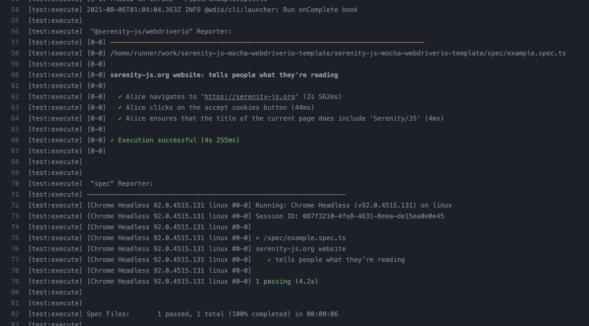

WebdriverIO is one of the most popular test frameworks and an excellent Web integration tool.

In fact, it's one of my favourites ❤️

But, to write **truly great acceptance tests** you need more than that:

- You need **business-friendly abstractions** that capture the language of your domain and make even the most sophisticated, multi-actor, and cross-system workflows easy to design and adapt as the requirements change.
- You need **in-depth reporting** that tells you not only what tests were executed, but also what requirements and business capabilities have (and have not!) been tested.
- And on top of that, you need to be able to interact with **all the interfaces** of your system, so that the slower UI-based interactions are just one tool in your testing toolbox, rather than your only option.

Of course, all the above is way outside of the scope of what WebdriverIO is trying to accomplish.

Typically, you and your team would need to figure it out all by yourselves.

But, what if I told you that there was a **better way**? That there was another framework that's perfectly compatible with WebdriverIO and optimised to help you write **world-class, full-stack acceptance tests** following the [Screenplay Pattern](https://serenity-js.org/handbook/design/screenplay-pattern.html) and [SOLID](https://en.wikipedia.org/wiki/SOLID) design principles, even if not everyone on your team is an experienced test engineer?

What if I told you that this framework also covers **business-friendly reporting** and helps you write **high-quality test code** that's **easy to understand**, **maintain**, and **reuse across projects and teams**?

What if I told you that you could add it to your **existing WebdriverIO test suites**, today?

Please allow me to introduce, [Serenity/JS](https://serenity-js.org)!

### About Serenity/JS

[Serenity/JS](https://serenity-js.org) is an open-source **acceptance testing** and **integration framework**, designed to make writing truly great acceptance tests **easier**, **more collaborative**, and **fun**! 🚀

While you can use Serenity/JS to test systems of any complexity, it works particularly well in complex, workflow-based, multi-actor contexts.

At a high level, Serenity/JS is a modular framework that provides [adapters](https://serenity-js.org/modules/) that make it easy to integrate your tests with [Web apps](https://serenity-js.org/modules/webdriverio/), [REST APIs](https://serenity-js.org/modules/rest/), [Node.js servers](https://serenity-js.org/modules/local-server/), and [pretty much anything](https://serenity-js.org/handbook/integration/architecture.html) a Node.js program can talk to.

Thanks to Serenity/JS [Screenplay Pattern](https://serenity-js.org/handbook/design/screenplay-pattern.html), you and your team will also have a simple, consistent, and **async-friendly** [programming model](https://serenity-js.org/handbook/thinking-in-serenity-js/index.html) across all those interfaces.

Apart from integrating with your system under test, Serenity/JS can also integrate with popular test runners such as [Cucumber](https://serenity-js.org/modules/cucumber/), [Jasmine](https://serenity-js.org/modules/jasmine/), [Mocha](https://serenity-js.org/modules/mocha/), [Protractor](https://serenity-js.org/modules/protractor/), and now also [WebdriverIO](https://serenity-js.org/modules/webdriverio/)!

Better yet, Serenity/JS provides a unique [reporting system](https://serenity-js.org/handbook/reporting/index.html) to help you generate consistent test execution and feature coverage reports across all the interfaces of your system and across all your test suites.
Serenity/JS reporting services can work together with your existing WebdriverIO reporters too!

### Thinking in Serenity/JS

The best way to get started with Serenity/JS is to follow our brand-new series of tutorials, where you'll learn how to build full-stack test automation frameworks from scratch.

Check out ["Thinking in Serenity/JS"](https://serenity-js.org/handbook/thinking-in-serenity-js/index.html) 🤓

### Examples and project templates

If you prefer to kick the tires and jump straight into the code, you'll find [over a dozen example projects](https://github.com/serenity-js/serenity-js/tree/master/examples) in the [Serenity/JS GitHub repository](https://github.com/serenity-js/serenity-js) and plenty of code samples in our [API docs](https://serenity-js.org/modules/webdriverio/).

We've also created WebdriverIO + Serenity/JS project templates to help you get started:
- [WebdriverIO, Serenity/JS and Cucumber](https://github.com/serenity-js/serenity-js-cucumber-webdriverio-template/)
- [WebdriverIO, Serenity/JS and Mocha](https://github.com/serenity-js/serenity-js-mocha-webdriverio-template/)

All the above templates are configured to produce **Serenity BDD HTML reports**, **automatically capture screenshots** upon test failure, and run in a **Continuous Integration** environment.

### Adding Serenity/JS to an existing project

If you're using WebdriverIO with Mocha, run the following command in your computer terminal to add the relevant [Serenity/JS modules](https://serenity-js.org/modules) to your project:

```shell
npm install --save-dev @serenity-js/{code,console-reporter,mocha,webdriverio}
```

If you're using Cucumber or Jasmine instead, replace [`mocha`](https://serenity-js.org/modules/mocha) with the name of your preferred test runner, so [`cucumber`](https://serenity-js.org/modules/cucumber) or [`jasmine`](https://serenity-js.org/modules/jasmine), respectively.

Next, tell WebdriverIO to use Serenity/JS instead of the default framework adapter:

```ts title=wdio.conf.ts
import { ConsoleReporter } from '@serenity-js/console-reporter';
import { WebdriverIOConfig } from '@serenity-js/webdriverio';

export const config: WebdriverIOConfig = {

    // Enable Serenity/JS framework adapter
    // see: https://serenity-js.org/modules/webdriverio/
    framework: '@serenity-js/webdriverio',

    serenity: {
        // Use Serenity/JS test runner adapter for Mocha
        runner: 'mocha',        // see: https://serenity-js.org/modules/mocha/
        // runner: 'jasmine',   // see: https://serenity-js.org/modules/jasmine/
        // runner: 'cucumber',  // see: https://serenity-js.org/modules/cucumber/

        // Configure reporting services
        // see: https://serenity-js.org/handbook/reporting/
        crew: [
            ConsoleReporter.forDarkTerminals(),
        ],
    },

    // ... other WebdriverIO configuration
}
```

And that's it!

The above configuration enables [Serenity/JS Console Reporter](https://serenity-js.org/modules/console-reporter), which produces output similar to the below and plays nicely with any existing WebdriverIO reporters you might have already configured:



To enable **Serenity BDD HTML Reporter**, please [follow the instructions](https://serenity-js.org/handbook/reporting/serenity-bdd-reporter.html).

To learn about Serenity/JS [Screenplay Pattern](https://serenity-js.org/handbook/design/screenplay-pattern.html), [follow the tutorial](https://serenity-js.org/handbook/thinking-in-serenity-js/index.html).

### Questions? Feedback? Ideas?

If you have questions about Serenity/JS or need guidance in getting started, join our friendly [Serenity/JS Community Chat channel](https://gitter.im/serenity-js/Lobby).

For project news and updates, follow [@SerenityJS](https://twitter.com/SerenityJS) on Twitter.

And if you like Serenity/JS and would like to see more articles on how to use it with WebdriverIO, remember to give us a ⭐ on [Serenity/JS GitHub](https://github.com/serenity-js/serenity-js)! 😊

Enjoy Serenity!

Jan
