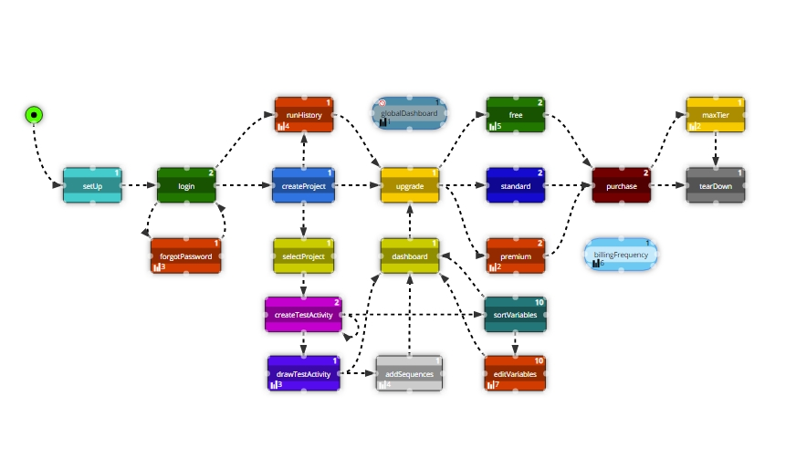
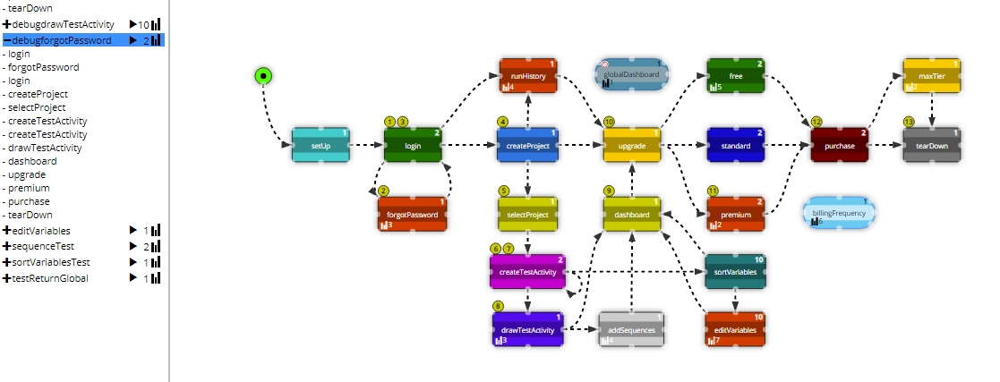
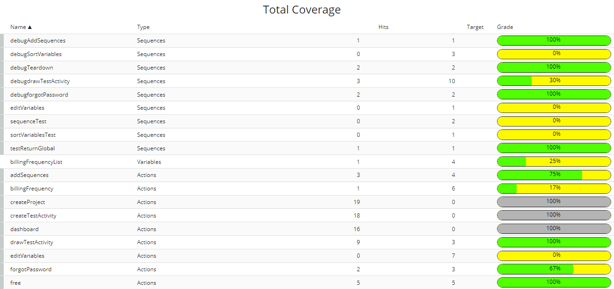

#### Do you remember the "1000 songs in your pocket" story that Apple used to launch the iPod?

A picture is worth a 1000 tests, so how about having "**1000 tests in one diagram?**"  Are you fed up of writing spec file, after spec file, after spec file to capture all of your required tests? Difficult to reuse, not representative of how real users will journey through your app and painful to manage what you have or have not tested? That's why we set about developing [Vitaq AI](https://webdriver.io/docs/wdio-vitaqai-service)!

   <i style={{'font-size': '12px', 'color': '#999'}}>
   Test Activity diagram for Vitaq to test Vitaq
   </i>

 
The default usage model for WebdriverIO is to code a single spec file to define a single test.  Inevitably, this results in 1000's of spec files being developed to test the application, with each spec file testing a single aspect of the application.

With Vitaq AI, we have simplified the problem for you. We use a single spec file to represent the testing to be executed on a specific page of the application under test, Vitaq AI then controls the order of execution of the spec files.  At it's simplest this allows us to define a simple sequence of spec files to execute in a defined order but it also allows us to execute the spec files in any order that is allowed by your app under test, including doing things like executing the same spec file multiple times in a loop.

Ah, I hear you cry, but how do I define what is allowable in my application?  Easy, we have a browser based graphical environment (*all you hardcore 'code-only' folks bear with me*) that allows you to capture what we call a ["Test Activity Diagram"](https://vitaq.online/documentation/), this defines the pages you can go to from any page in the application.  With the Test Activity diagram comes many huge benefits:

- Vitaq AI can automatically generate endless test paths through your application, doing all of the allowable, but unexpected things that a real human user would do.
- Vitaq AI also has the ability to generate data to be used during testing to add to the range of the testing
- Targets can be specified for sequences, individual spec files and for variables and Vitaq AI will ensure that the targets are met
- Changes in the application can be quickly captured in the test-activity diagram and the testing will immediately reflect the changes.  This makes it easy to grow and change the testing as the application evolves.

   <i style={{'font-size': '12px', 'color': '#999'}}>
   Test Activity diagram for Vitaq to test Vitaq showing a user journey
   </i>

All of this means that it is easy to create a large amount of test activity, that is auto-generated on the basis of "what is allowable" rather than "coding test, after test, after test".  This means that Vitaq AI can help you find bugs that other approaches miss.

#### When do you know you have done enough testing?
That age old test problem of when is enough, enough? When do you stop? Because Vitaq AI automatically generates tests, it is also keeping track of what has been tested.  Sure, you can (should) use code coverage to keep a track of which code has been executed.  But (in the simplest case) if the code is always executed on the happy paths and known "unhappy paths" (i.e. those whose errors are handled), then code coverage will be high but we may have missed some nasty errors that were never imagined.  

What we need to do instead is track the functional coverage. Yes, with our new tool, you get a wonderful new metric, functional coverage. We measure how often have we have executed a specific piece of functionality?

   <i style={{'font-size': '12px', 'color': '#999'}}>
   Functional Coverage view for Vitaq testing Vitaq
   </i>

For this reason, Vitaq AI measures functional coverage. The functional coverage is triggered by one of three events:
- A specified sequence of spec files are executed, this might be end-to-end or it might just be a sequence of spec files within the app that you want to see executed
- A specified spec file is executed, maybe this is a less critical page, but still you want to make sure that it is tested (e.g. an "About Us" page).
- A test data variable or a specific value of the variable is used in a spec file (e.g. you have a list of unallowable passwords and you want to make sure that all values in the list are tried and rejected).
By setting targets for the functional coverage we can ensure that the key functionality has been sufficiently tested.  Functional coverage gives a more user centric view of the testing than code coverage does, since it tells us that the specific UI events that we are interested in testing have been triggered.

Vitaq AI also records a run history for every test executed and the pass/fail status of the spec file, which allows us to quickly and easily work through the testing that has been performed and identify where there may have been failures

#### Why do you need a test activity diagram?
The test activity diagram is where we specify the relationship between the pages, specifically which pages you can go to from each page in the application.  This has various advantages over the standard coding of spec file, after spec file, after spec file approach:
- Most importantly, the test activity diagram requires us to define what is allowable or possible in the application.  This forces a change in the way we think about testing, from "What set of steps do I need to run to test feature X" to "I'm currently on page Y, what can I do on this page and where am I allowed to go from here".  This change means Vitaq will end up doing things that real users might do, but that you don't expect them to do, like logging out half way through the checkout process!
- The test activity diagram is a graphical representation of your application under test and this is a powerful way of planning, discussing and analysing the testing with the team. It will help you to drive the testing logic out into the open for everyone to see.
- The test activity diagram will evolve alongside your application development to allow rapid response to changes and additions.

#### Why should hardcore code only testers care?
Earlier I asked the hardcore "code-only" folks to bear with me.
Creating test software is a difficult task, there is a continuous tension between the preference of some users for a low-code, graphical environment and that of other users to be able to do **everything** in code, sometimes these extremes exist within the same team.

Vitaq AI can work at both extremes, in the case of the preference for low-code, the test activity diagram can be created and edited in a graphical environment.  The spec file structure can be created automatically using one of our [utility scripts](https://vitaq.online/documentation/vitaqUtilityScripts#vitaq_quickstart) and the contents of the spec file can be captured using the [Chrome DevTools Recorder](https://webdriver.io/docs/record/) and pasted into the spec files.  Whilst this does require a little coding knowledge, it has minimised the amount of coding required.

For those who prefer to do everything in code, Vitaq AI has a [rich API](https://vitaq.online/documentation/vitaqLibraryActions) and there is a huge amount of control available, which allows the coder to interact with and modify the test activity diagram from the spec files.  

We have been developing this for a long time. We hope you like it and it helps you solve the difficult problem of thoroughly testing complex web and mobile apps.

We sure would be delighted to receive your feedback. Both good and bad. They do say that you learn a lot more when you fail! But for you app testers, failure is not an option! Or your company could end up on the front page of the Wall Street Journal for all the wrong reasons. 

You can [register for an account](https://vitaq.online/register) right now.  Get started using Vitaq AI, for free, by following the [Getting Started Guide](https://vitaq.online/documentation/gettingStarted), you'll be up and running with Vitaq AI in under 5 minutes.

If you have any questions or comments please contact us at support@vertizan.com.
