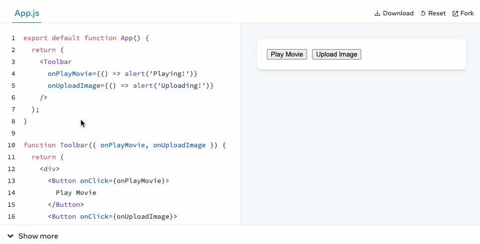
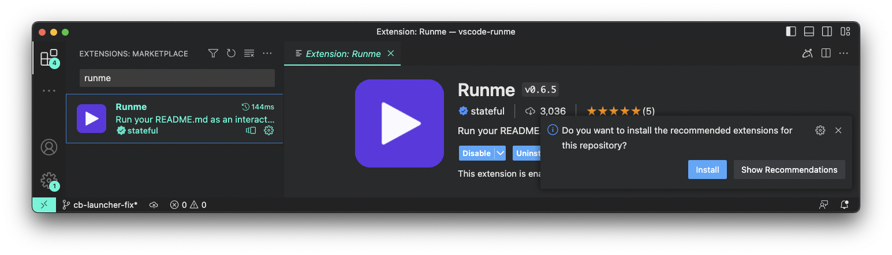

The WebdriverIO framework is a versatile tool that offers a lot of features for you to play around with. The goal of our [project documentation](https://webdriver.io) is to communicate these features well and give you an understanding, on how they could be applied in your project. A central contributor to this are code examples. Many times they can convey the principle idea of a feature like a picture that is worth a thousand words.

It is not a surprise that many projects out there have code examples embedded in their project documentation. Many of them are even interactive and allow users to fiddle around with the code in real time, e.g. the [new React Docs](https://beta.reactjs.org/learn/adding-interactivity), or provide "playgrounds" with live examples, like on [svelte.dev](https://svelte.dev/examples/hello-world).


<center><em>Live Examples on the <a href="https://beta.reactjs.org/learn/adding-interactivity" target="_blank">new React docs</a></em></center>

<br />

When it comes to having code examples on a documentation page, a common problem that arises with them is that examples:

- are made up and often don't reflect reality
- contain errors because we are all just humans
- are getting outdated as interfaces change
- can be difficult to apply in your own project

As an attempt to improve our code examples on this project page we started to roll out some changes to the documentation that hopefully addresses these issues:

```ts reference
https://github.com/webdriverio/example-recipes/blob/main/queryElements/singleElements.js#L9-L10
```

As you can see, some examples now have two buttons that allow you to run them or view them on GitHub. But what does that mean?

## Extract Examples from Docs

As a first step we started to remove all code examples from our documentation page and moved them into a [dedicated repository](https://github.com/webdriverio/example-recipes). This allows us to treat these examples as code and set-up the necessary infrastructure, e.g. CI/CD or automated dependency updates, to ensure quality and correctness.

So say hello 👋 to this new repository in our organization that now contains a lot of examples that we re-use on this website.


<center><em><a href="https://github.com/webdriverio/example-recipes" target="_blank">webdriverio/example-recipes</a></em></center>

<br />

You can see that every example is self contained in its own directory to keep everything very simple. A big list of [NPM scripts](https://github.com/webdriverio/example-recipes/blob/a49fdf935b689aafc22219ea534e119796cb9f07/package.json#L24-L59) allows you to run specific examples with just a single command.

In order to embed the examples back into the website, we are using a [plugin for Docusaurus](https://github.com/christian-bromann/docusaurus-theme-github-codeblock) that downloads the code based on a simple GitHub reference link. So instead of having code within our markdown files, we just reference the location on Github, e.g.:

    ```ts reference
    https://github.com/webdriverio/example-recipes/blob/main/setup/testrunner.js#L5-L8
    ```

The plugin then downloads the code and only shows provided code lines of that file. Here is the final result of that:

```ts reference
https://github.com/webdriverio/example-recipes/blob/main/setup/testrunner.js#L5-L8
```

If you are using a different tool for building your static docs, chances are that it has similar plugins available to just do that.

## Testing Examples

Now that we have everything nicely encapsulated into a dedicated repository, we can use CI/CD to test all examples on regular basis. A simple [GitHub workflow](https://github.com/webdriverio/example-recipes/blob/main/.github/workflows/test.yml) can trigger the execution of these examples and have the pipeline fail if any of them have an error:

```yaml
name: Test
on: [push, pull_request]
jobs:
  test:
    runs-on: ubuntu-latest
    strategy:
      matrix:
        exampleDir:
          - click
          # more example directories here
          # ...
          - api/webdriver
    steps:
        - name: Checkout
          uses: actions/checkout@v3
        - uses: actions/setup-node@v3
          with:
            node-version: 18
        - name: Install
          run: npm install
        - name: Test
          run: npm run ${{ matrix.exampleDir }}
          working-directory: ${{ matrix.exampleDir }}
```

Most of the examples are written as normal WebdriverIO test files and contain normal assertions like any other test would do, e.g. an example that shows how to fetch elements using command chaining would be written as following:

```ts
it('should get the text of a menu link', async () => {
    const menu$ = await $('#menu') // or `browser.$('#menu')`
    console.log(await menu$.$$('li')[2].$('a').getText()) // outputs: "API"

    await expect(menu$.$$('li')[2].$('a')).toHaveText('API')
})
```

With the ability to reference certain code lines we can just strip out the testing part of the example and focus on what's important:

```ts reference
https://github.com/webdriverio/example-recipes/blob/main/queryElements/singleElements.js#L9-L10
```

## Keep Examples up to Date

Another advantage of having a CI/CD infrastructure is the ability to use workflows that ensure everything stays up to date. Since WebdriverIO code is hosted on GitHub, we setup Dependabot to [update all dependencies](https://github.com/webdriverio/example-recipes/blob/main/.github/dependabot.yml) on weekly basis. An additional [GitHub workflow](https://github.com/webdriverio/example-recipes/blob/main/.github/workflows/update.yml) helps us to auto-merge these dependency updates so that we only need to deal with them in case they cause issues due to failing tests.

This process is very important and helps us to ensure that changes in WebdriverIO don't break any of our examples we use in our documentation. It is also a great additional feedback loop and creates more confidence when a new version is released that did not break any of our examples.

## Make Examples Easy Accessible

Lastly, to make every example very easy to access and run, we are using a feature of a very cool VS Code Extension called [Runme](https://runme.dev/) that helps to check out code locally with a simple click on a button. If you haven't installed Runme yet, go check it out on the [VS Code Marketplace](https://marketplace.visualstudio.com/items?itemName=stateful.runme) or find it in your VS Code:


<center><em>Runme on the <a href="https://marketplace.visualstudio.com/items?itemName=stateful.runme" target="_blank">VS Code Marketplace</a></em></center>

<br />

Many surveys have shown that VS Code is the dominant IDE for many developers around the world. With the `Run Example` button we allow all these users to access the repository with a single click. The button is a simple link with a custom `vscode://` protocol that will prompt you for permission to open it in VS Code. There, the extension will pick up the link information containing which repository it needs to check out and which markdown file to open. If the extension is not installed, it will automatically do that for you, if you consent.


<center><em>Run Example with <a href="https://runme.dev" target="_blank">Runme</a></em></center>

<br />

Once the repository is checked out, Runme will open a dedicated `README.md` for the example in an interactive notebook experience. It will explain the example and walks you through it. It allows to execute the code cells within the VS Code terminal securely so that setting up and running the example is done with a simple click and requires no additional application to be opened.

For folks that don't have VS Code installed can still access the repository, check it out manually and run the examples as well.

## Get Involved

WebdriverIO has many examples and a lot of commands and APIs to document. This is a great opportunity for you to get involved and contribute to the project by:

- adding more examples to [`webdriverio/example-recipes`](https://github.com/webdriverio/example-recipes) or
- reference existing examples in our documentation

Feel free to also raise [an issue](https://github.com/webdriverio/webdriverio/issues/new/choose) if you have any questions or feedback.

I think this is a very cool way to provide an interactive and simple way to provide code examples for a framework that requires a specific environment that is not a browser, e.g. Node.js. If you are a framework author and run your docs with Docusaurus, feel free to copy this approach if you like it. It's Open Source and free.

Thanks for reading!
