<div align="center">
  
</div>

<br />

This article is a must-read for those experiencing headaches with mobile automation testing in the context of Continuous Integration and Continuous Deployment (CICD), particularly when it involves native mobile Apps for Android and iOS. It’s quite challenging to find sufficient resources that cover this specific topic.

Within this article, I will guide you through a detailed step-by-step process on how to create a comprehensive end-to-end test pipeline at no cost, utilizing GitHub Actions for both the iOS and Android platforms. We will be using our beloved WebdriverIO framework throughout the tutorial.

## Challenge

Our challenge is to establish a unified pipeline workflow that enables testing of our native mobile application on both the iOS and Android platforms. In a [previous article](https://medium.com/innovies-club/building-a-complete-e2e-pipeline-for-testing-native-mobile-apps-with-webdriverio-f2828753aa5d), we thoroughly explored the process of constructing a pipeline for testing an Android app using an emulator with GitHub Actions. To handle the E2E test for the Android component, we will reuse that workflow. However, we still need to address the remaining bigger challenge of creating a separate job for the iPhone/iPad simulator.

During my research, I came across an incredibly useful but often overlooked feature which is, the macOS GitHub runner comes [pre-equipped](https://github.com/actions/runner-images/blob/main/images/macos/macos-13-Readme.md) with Xcode, the necessary SDKs for iPhone iOS simulators. This realization sparked an idea in my mind: why not replicate the process we followed for the Android emulator but this time for the iOS simulator? This is particularly exciting because GitHub Actions’ iOS runner supports virtualization, making it a viable option for our purposes.

This feature allows us to build our pipeline without any additional costs (up to a maximum of 2000 minutes).

<div align="center">
  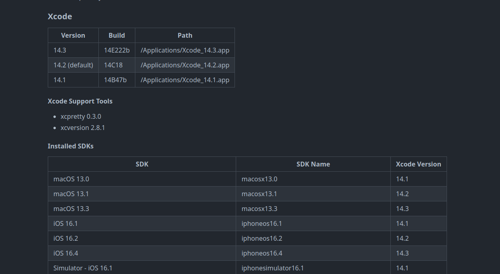
</div>


## Workflow structure

Our GitHub actions workflow will be basically the same as Android in the core concept but with a little technical variation

- Create simulator
- Install dependencies
- Execute the test
- Generate the report

Looks pretty straightforward, but how? Let’s see

<br />

### Step 1
As previously mentioned, the GH Actions runner comes packed with a range of available simulators. While we could utilize one of these existing simulators, it would require using the deviceName and it's

randomly changing UUID for each execution. However, you can still extract the relevant UUID using shell commands.

To simplify the process and increase flexibility, we will create our own simulator. Since Xcode is already installed, we can make use of the “xcrun” CLI. To create a simulator from the installed iOS versions using the terminal, simply execute the following command:

```bash
xcrun simctl create "Iphone 14 Pro" "com.apple.CoreSimulator.SimDeviceType.Iphone-14-Pro" "com.apple.CoreSimulator.SimRuntime.iOS-16-0"
```

Executing this command will result in the immediate creation of a simulator and the subsequent retrieval of its UUID.

<br />

To enhance re-usability and optimize the process, we can encapsulate this command within a shell script. With a few modifications, we can ensure that the UUID is stored as an environment variable in GitHub Runner which we will eventually use for our test capabilities.

```bash
#!/bin/bash

# Set iPhone model and iOS version
iphone_model="${IPHONE_MODEL// /-}"
ios_version="${IOS_VERSION//./-}"
simulator_name="${iphone_model}"
simulator_udid=$(xcrun simctl create "$IPHONE_MODEL" "com.apple.CoreSimulator.SimDeviceType.$iphone_model" "com.apple.CoreSimulator.SimRuntime.iOS-$ios_version")

# Export the simulator UDID as an environment variable
export SIMULATOR_UDID="$simulator_udid"
echo "SIMULATOR_UDID=$SIMULATOR_UDID" >> $GITHUB_ENV

# Boot the simulator
xcrun simctl boot "$simulator_udid"
```

By using the script above, we can provide the device model and iOS version as environment variables which can be stored in the environment sections in our workflow, this will create the simulator and store its UUID in GITHUB_ENV. This UUID will be essential for configuring the desired capabilities in our tests.

<span style="color: #999999; font-style: italic;">
Since we are using IPHONE_MODEL and IOS_VERSION as environment variable in our shell script then we will have to set them in the environment section as shown below
</span>

<br />

### Step 2
After successfully creating and booting up the simulator in the previous step, it’s crucial to verify that the process was completed without any issues and that the device is fully prepared for use.

<br />

<div align="center">
  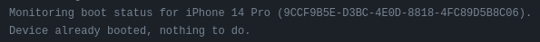
</div>

<br />

To ensure the successful starting of our test, it is crucial to confirm that the IOS has fully booted. For this purpose, I have created a code snippet that continuously monitors the device’s status until a specific output is obtained, signifying the completion of the simulator’s booting process.

```bash
#!/bin/zsh

function wait_for_boot() {
  printf "${G}==> ${BL}Waiting for the simulator to boot...${NC}\n"
  start_time=$(date +%s)
  spinner=( "⠹" "⠺" "⠼" "⠶" "⠦" "⠧" "⠇" "⠏" )
  i=0
  # Get the timeout value from the environment variable or use the default value of 60 seconds
  timeout=${BOOT_TIMEOUT:-60}

  while true; do
    output=$(xcrun simctl bootstatus "$SIMULATOR_UDID")
    echo "${output}"
    if [[ $output == *"Device already booted, nothing to do."* ]]; then
      printf "\e[K${G}==> \u2713 Simulator booted successfully${NC}\n"
      exit 0
    else
      printf "${YE}==> Please wait ${spinner[$i]} ${NC}\r"
      i=$(( (i+1) % 8 ))
    fi

    elapsed_time=$(( $(date +%s) - $start_time ))
    if [[ $elapsed_time -ge $timeout ]]; then
      printf "${RED}==> Timeout waiting for simulator to boot 🕛${NC}\n"
      exit 1
    fi

    sleep 1
  done
}

# Call the wait_for_boot function
wait_for_boot
```

<br />

### Step 3
Proceeding further, we will cover the necessary steps and dependencies required for executing your tests. This includes the installation of Appium, the XCUITest driver, and the essential Node.js libraries.

```json
  "devDependencies": {
    "@wdio/allure-reporter": "^8.10.4",
    "@wdio/appium-service": "^8.10.5",
    "@wdio/cli": "^8.10.5",
    "@wdio/local-runner": "^8.10.5",
    "@wdio/mocha-framework": "8.10.4",
    "@wdio/spec-reporter": "8.8.7",
    "ts-node": "^10.9.1",
    "typescript": "^5.0.4"
  },
  "dependencies": {
    "allure-commandline": "^2.22.1",
    "appium": "2.0.0-beta.71",
    "appium-uiautomator2-driver": "*",
    "appium-xcuitest-driver": "*"
  }

```

<p align="center">
  <span style="display: inline-block; width: 600px; border-top: 1px solid #E45A28;"></span>
</p>

## Connecting the Puzzle Pieces

Since now the key elements required to set up the environment for executing our mobile automation tests on the iOS simulator are ready, Let’s wrap them all into a single yaml file for GH actions

```yaml
name: Wdio-x-native

on:
  workflow_dispatch:

env:
  IPHONE_MODEL: iPhone 8
  IOS_VERSION: 16.2
  BOOT_TIMEOUT: 700

jobs:
  ios:
    runs-on: macos-13

    steps:
      - uses: actions/checkout@v3
         
      - name: Export environment variables
        run: |
          export IPHONE_MODEL=$IPHONE_MODEL
          export IOS_VERSION=$IOS_VERSION
     
      - name: Start simulator
        run: |
          chmod a+x ./sscript/start_simu.sh
          ./sscript/start_simu.sh
     
      - name: Install dependencies
        run: | 
          npm i
          
      - name: Check simulator booting status
        run: |
          chmod a+x ./check_simu.sh
          ./check_simu.sh

      - name: Execute the test
        run: | 
          npm run ios
```

<span style="color: #999999; font-style: italic;">
combine the simulator status check and simulator start into a single shell script would have been possible. However, I intentionally separated them to execute them individually. This allows me to utilize the time taken for the simulator to boot up and install the remaining dependencies. Afterwards, I can then proceed to check the status of the simulator, Similarly we will apply same approach to Android emulator (check previous article)
</span>

<p align="center">
  <span style="display: inline-block; width: 600px; border-top: 1px solid #E45A28;"></span>
</p>

## Build cross-platform workflow

The time now to combine our Android workflow from the previous article without Ios workflow into one single workflow, using the matrix strategy as follows:

```yaml
name: Wdio-x-native

on:
  workflow_dispatch:
        
env:
  IPHONE_MODEL: iPhone 8
  IOS_VERSION: 16.2
  API_LEVEL: 32
  EMULATOR_NAME: Nexus
  EMULATOR_DEVICE: Nexus 5
  EMULATOR_VERSION: 12
  ANDROID_ARCH: x86_64
  ANDROID_TARGET: google_apis
  ANDROID_BUILD_TOOLS_VERSION: 34.0.0-rc4
  ANDROID_SDK_PACKAGES: system-images;android-32;google_apis;x86_64 platforms;android-32 build-tools;34.0.0-rc4 platform-tools emulator
  EMULATOR_TIMEOUT: 350
  BOOT_TIMEOUT: 700

jobs:
  ios:
    runs-on: 
       - macos-13
    strategy:
      matrix:
        os: [IOS]
        device: [$IPHONE_MODEL]
        version: [$IOS_VERSION]
    steps:
      - uses: actions/checkout@v3
         
      - name: Export environment variables
        run: |
          export IPHONE_MODEL=$IPHONE_MODEL
          export IOS_VERSION=$IOS_VERSION
     
    -------->
     

  android:
    runs-on: macos-13
    strategy:
      matrix:
        os: [Android]
        emulator_name: [$EMULATOR_NAME]
    steps:
      - uses: actions/checkout@v3
      
      - name: Add avdmanager and sdkmanager to system PATH
        run: |
          echo "$ANDROID_HOME/cmdline-tools/latest/bin:$ANDROID_HOME/emulator:$ANDROID_HOME/tools:$ANDROID_HOME/platform-tools:$ANDROID_HOME/build-tools/${{ env.ANDROID_BUILD_TOOLS_VERSION }}" >> $GITHUB_PATH
      
      - name: Install Sdk
        run: |
          yes Y | sdkmanager --licenses
          sdkmanager --install ${ANDROID_SDK_PACKAGES}
      
      - name: Build emulator

    -------->

```

In the above example, we have integrated the IOS workflow mentioned earlier with the Android emulator workflow described in our previous [article](https://medium.com/@Amr.sa/build-xplatform-native-mobile-automation-test-with-wdio-like-a-pro-4e8acc797ffe).

<br />

<span style="color: #999999; font-style: italic;">
WebdriverIO Caps
These are the recommended configurations that you may require for both the Android emulator and iPhone simulator. It’s important to note that the deviceName, platformVersion, and UUID are not hardcoded in our object. This flexibility allows us to easily switch between different versions and device models as needed.
</span>                                   
                    
<br />

   ```js
     emulator =
    [{
      'platformName': 'android',
      'appium:options': {
        'deviceName': process.env.CI ? process.env.EMULATOR_NAME : 'Nexus',
        'platformVersion': process.env.CI ? process.env.EMULATOR_VERSION : '13',
        'automationName': 'uiautomator2',
        'appPackage': 'com.wdiodemoapp',
        'appWaitPackage': 'com.wdiodemoapp',
        'appActivity': 'com.wdiodemoapp.MainActivity',
        'appWaitActivity': 'com.wdiodemoapp.MainActivity',
        'uiautomator2ServerLaunchTimeout': 200000,
        'uiautomator2ServerInstallTimeout': 200000,
        'appWaitForLaunch': true,
        'autoGrantPermissions': true,
        'adbExecTimeout': 200000,
        'androidInstallTimeout': 150000,
        'ignoreHiddenApiPolicyError': true,
        'noReset': true,
        'fullReset': false
      }
    }]

  simulator =
    [{
      platformName: 'iOS',
      'appium:options': {
        'deviceName': process.env.CI ? process.env.IPHONE_MODEL : 'Iphone-13',
        'platformVersion': process.env.CI ? process.env.IOS_VERSION : '15.5',
        'automationName': 'XCUITest',
        'bundleId': 'org.wdioNativeDemoApp',
        'app': 'iOS-Simulator-NativeDemoApp-0.4.0.app.zip',
        'udid': process.env.CI ? process.env.SIMULATOR_UDID : '15A098DB-B8A0-4D6A-9057-23FF1F0F0D9B',
        'useNewWDA': true,
        'usePrebuiltWDA': false,
        'wdaConnectionTimeout': 180000,
        'appWaitForLaunch': true,
        'noReset': true,
        'fullReset': false
      }
    }]
  ```

<p align="center">
  <span style="display: inline-block; width: 600px; border-top: 1px solid #E45A28;"></span>
</p>

## Initial Execution

The good news is that workflow is configured properly and the e2e test for the IOS app has been successfully executed

<br />

<div align="center">
  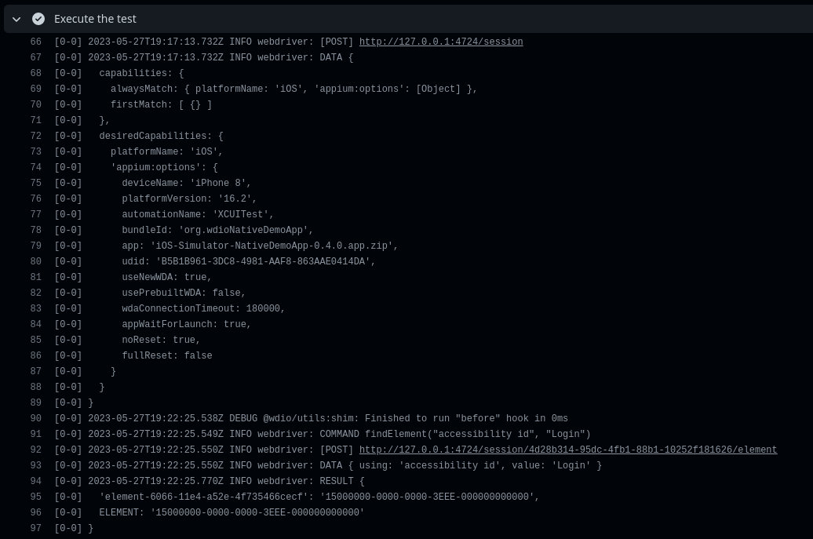
</div>

<br />

<div align="center">
  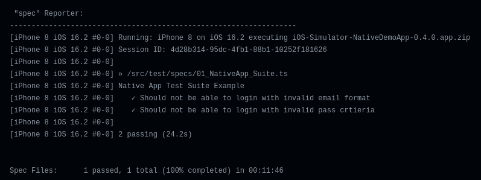
</div>

<br />

Though the end-to-end test for the iPhone simulator has passed, it was observed that the test for the Android emulator shows instability.

<br />

<div align="center">
  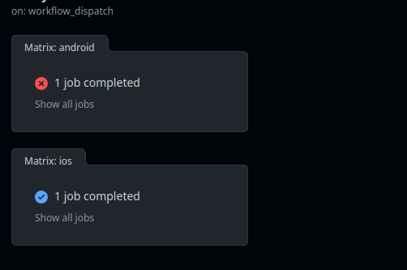
</div>

<br />

<p align="center">
  <span style="display: inline-block; width: 600px; border-top: 1px solid #E45A28;"></span>
</p>

## Debugging

<br />

### System UI Crush

It appears that running Android for the first time in headless mode occasionally results in random system UI unresponsive issues. Unfortunately, this issue is preventing us from executing the tests as the UI system is unresponsive which consequently disrupts Appium from proper interaction with the app.

The issue was confirmed when reviewing the allure report screenshots

<br />

<div align="center">
  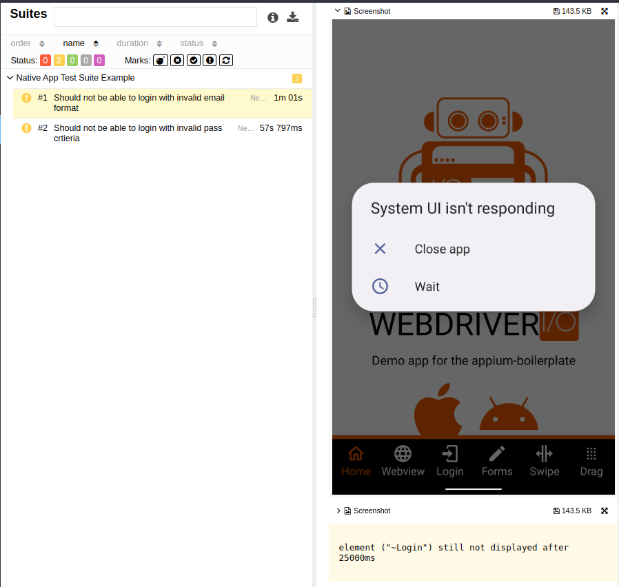
</div>

<br />

This explains why the terminal log displayed that Appium was unable to locate any element, despite the successful launch of the app.

<br />

<div align="center">
  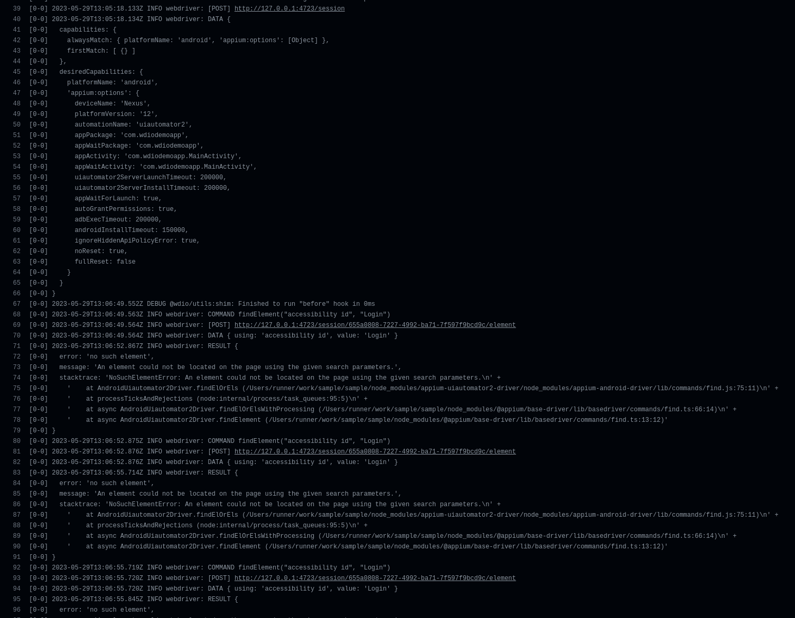
</div>

<br />

This makes sense as Appium is trying to find the desired element but on the current running activity which is “.systemui”, even though our target app is launched in the background

<br />

### Connection timeout
It has been noted that on certain occasions, Appium encountered failures in initiating the test, with all connection retry attempts proving unsuccessful. However, after conducting a thorough investigation, it was discovered that the installation of the Apk file to the Android emulator through the app:“./test.apk” capability was taking an unusually long time, requiring a significantly extended connection timeout to ensure successful installation which is not the best solution.

Now that we have identified the issue and its root cause, it’s time to address and resolve them.

<p align="center">
  <span style="display: inline-block; width: 600px; border-top: 1px solid #E45A28;"></span>
</p>

## Resolving

<br />

### System UI Crush
Fortunately, we can utilize the advantage of being able to grep the current running activity on an Android device. This privilege allows us to detect whether the system UI or any similar Android service will crash or function normally. We can achieve this by executing the following adb shell command:

```shell script 
adb shell dumpsys window 2>/dev/null | grep -i mCurrentFocus
```

<br />

<div align="center">
  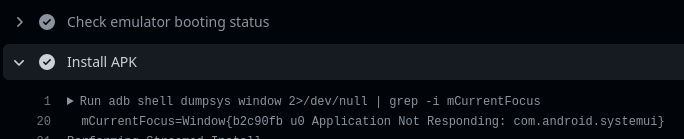
</div>

<br />

<div align="center">
  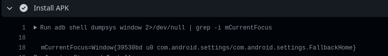
</div>

<br />

In our ongoing implementation, we can mimic our natural behavior when encountering this issue on an Android device. Specifically, we will continuously click the home button until the issue is resolved. Once the problem is resolved and the Android system is functioning correctly, we anticipate observing the “.NexusLauncherActivity” as the current main activity running (where “Nexus” represents the Android device).

In order to achieve this, I have developed the following shell script:

```bash
#!/bin/bash


function check_current_focus() {
  printf "==> Checking emulator running activity \n"
  start_time=$(date +%s)
  i=0
  timeout=20
  target="com.google.android.apps.nexuslauncher.NexusLauncherActivity"

  while true; do
    result=$(adb shell dumpsys window 2>/dev/null | grep -i mCurrentFocus)

    if [[ $result == *"$target"* ]]; then
      printf "==>  Activity is okay: \n"
      printf "$result\n"
      break
    else
      adb shell input keyevent KEYCODE_HOME
      printf "==> Menu button is pressed \n"
      i=$(( (i+1) % 8 ))
    fi

    current_time=$(date +%s)
    elapsed_time=$((current_time - start_time))
    if [ $elapsed_time -gt $timeout ]; then
      printf "==> Timeout after ${timeout} seconds elapsed 🕛.. \n"
      return 1
    fi
    sleep 4
  done
}

check_current_focus
```

The shown function above will continuously loop, If the main activity is not found (NexusLauncherActivity), it will send a home button event and repeat the process until its found or timeout is reached.

<br />

### Connection timeout
Rather than significantly extending the Appium connection timeout, I will handle the APK installation in a separate step along with the main activity checking.

```yaml
      - name: Install APK
        run: |
          adb install Android-NativeDemoApp-0.4.0.apk
          chmod a+x ./mainActivityCheck.sh
          ./mainActivityCheck.sh
```

<br />

<div align="center">
  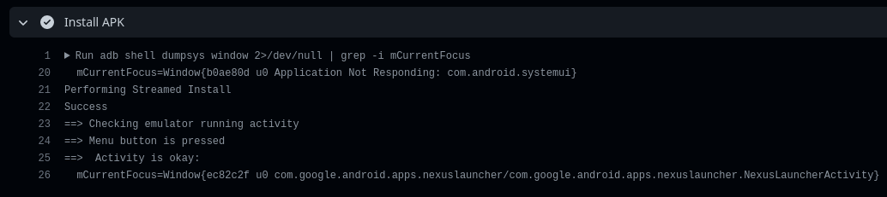
</div>

<br />

Excellent! Our solution has been executed successfully with the proper installation of the APK. As expected, the system UI was not responsive, and the shell script effectively managed and handled the situation.

<p align="center">
  <span style="display: inline-block; width: 600px; border-top: 1px solid #E45A28;"></span>
</p>

## Optimizing and Enhancing workflow

I have improved the workflow dispatch to provide better control over the platforms on which I can execute my tests, whether it be iOS, Android, or cross-platform.

```yaml
name: Wdio-x-native

on:
  workflow_dispatch:
    inputs:
      e2e:
         type: choice
         description: Select a platform
         required: true
         options: 
            - xplatform
            - ios
            - android
         default: xplatform
```

Consequently, our jobs should be adjusted

```yaml
name: Wdio-x-native

on:
  workflow_dispatch:
    inputs:
      e2e:
         type: choice
         description: Select a platform
         required: true
         options: 
            - xplatform
            - ios
            - android
         default: xplatform
        

permissions:
  contents: write
  pages: write
  id-token: write

env:
  IPHONE_MODEL: iPhone 8
  IOS_VERSION: 16.2
  API_LEVEL: 32
  EMULATOR_NAME: Nexus
  EMULATOR_DEVICE: Nexus 5
  EMULATOR_VERSION: 12
  ANDROID_ARCH: x86_64
  ANDROID_TARGET: google_apis
  ANDROID_BUILD_TOOLS_VERSION: 34.0.0-rc4
  ANDROID_SDK_PACKAGES: system-images;android-32;google_apis;x86_64 platforms;android-32 build-tools;34.0.0-rc4 platform-tools emulator
  EMULATOR_TIMEOUT: 350
  BOOT_TIMEOUT: 700

jobs:
  ios:
    runs-on: 
       - macos-13
    if: ${{ contains(github.event.inputs.e2e, 'ios') || contains(github.event.inputs.e2e, 'xplatform') }}
    strategy:
      matrix:
        os: [IOS]
        device: [$IPHONE_MODEL]
        version: [$IOS_VERSION]
    steps:
      - uses: actions/checkout@v3
      ------->

  android:
    runs-on: macos-13
    if: ${{ contains(github.event.inputs.e2e, 'android') || contains(github.event.inputs.e2e, 'xplatform') }}
    strategy:
      matrix:
        os: [Android]
        emulator_name: [$EMULATOR_NAME]
    steps:
      - uses: actions/checkout@v3
      ------->
```

<br />

<div align="center">
  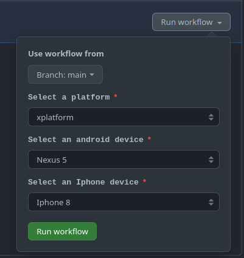
</div>

<br />

Finally, Generate our report and deploy it to the GitHub page out of the box

```yaml
      - name: Generate report
        if: always()
        run: | 
          npx allure generate report/allure-results    
         
      - name: Setup Pages
        if: always()
        uses: actions/configure-pages@v3
        
      - name: Upload artifact
        if: always()
        uses: actions/upload-pages-artifact@v1
        with:
          path: './allure-report'
          
      - name: Deploy to GitHub Pages
        if: always()
        id: deployment
        uses: actions/deploy-pages@v2
```


## Workflow Execution

<div align="center">
  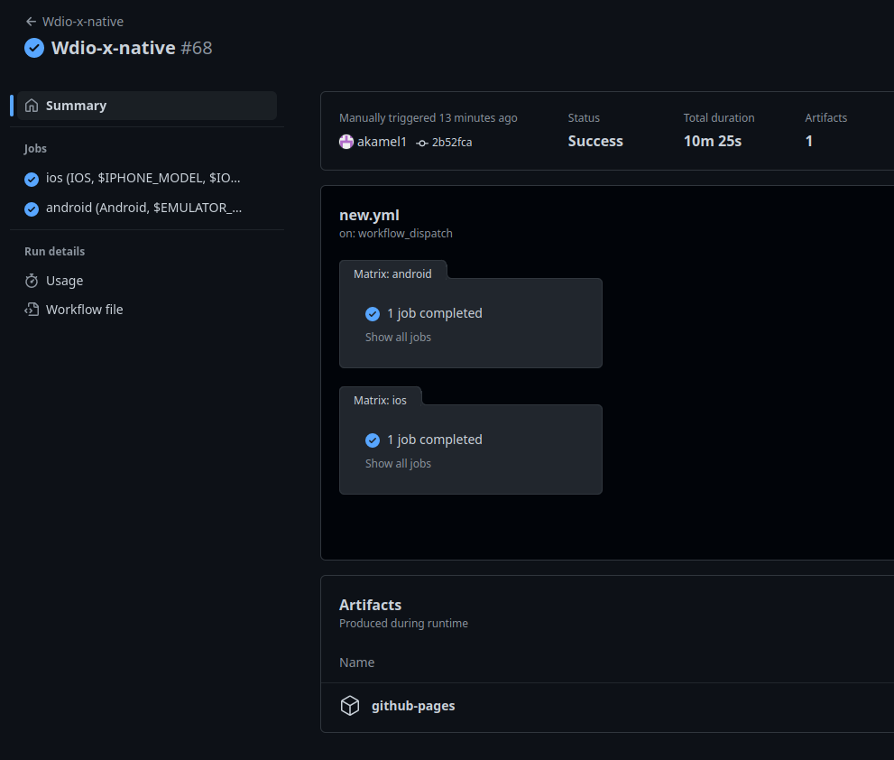
</div>

<br />

<div style="display: flex; justify-content: center; align-items: center;">
  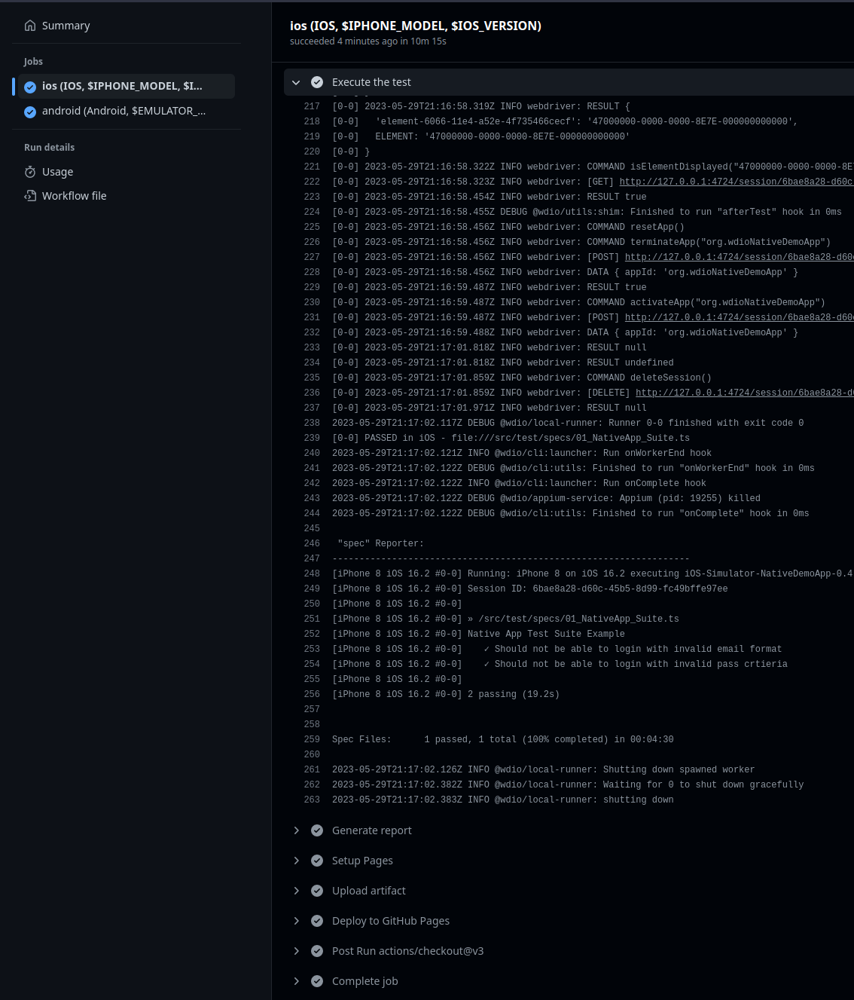
  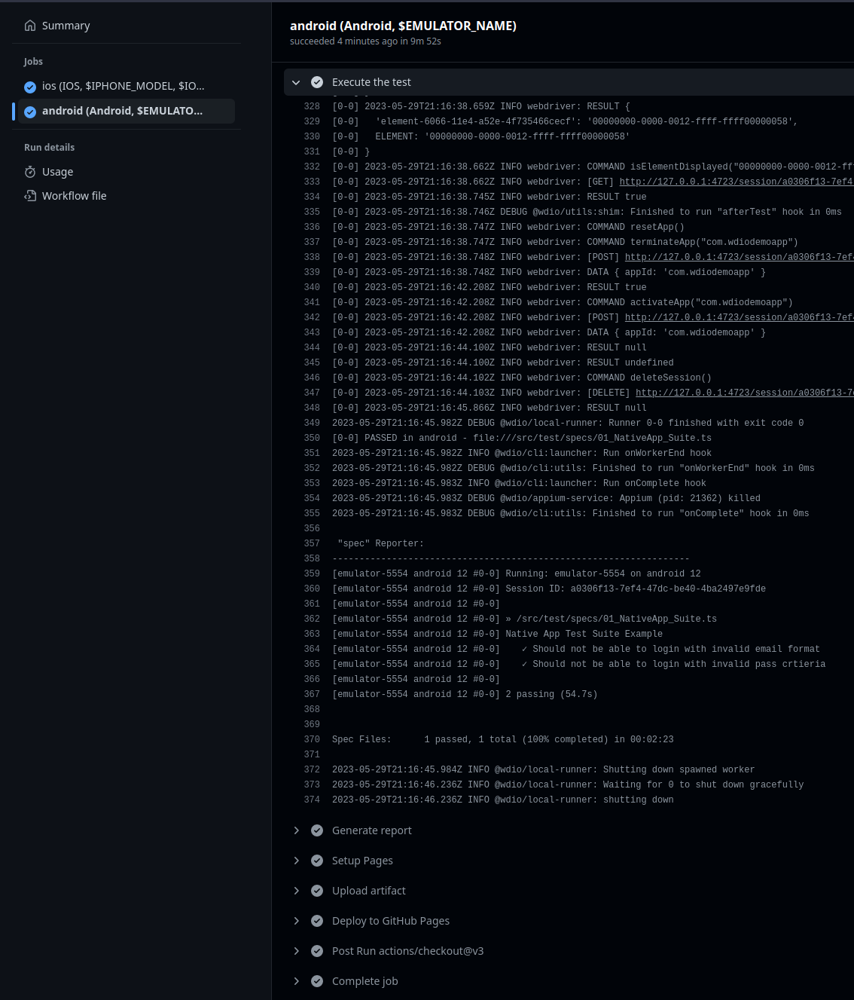
</div>

<div align="center">
  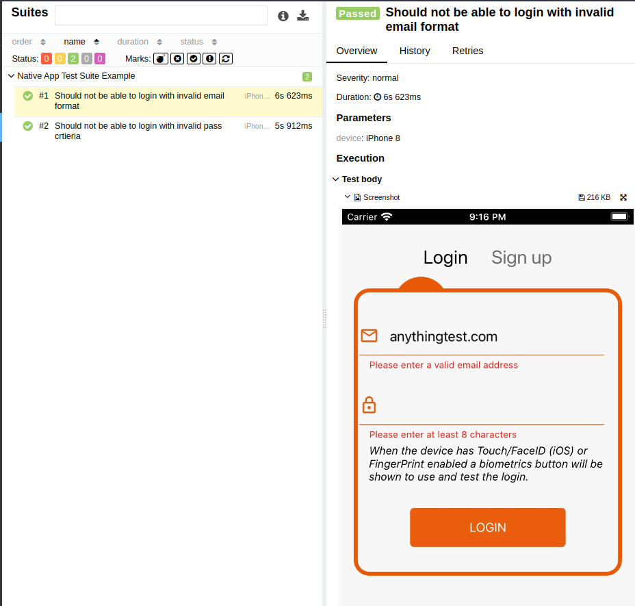
</div>

Fantastic news! Our workflow is now functioning flawlessly and exhibits complete stability. The workflow can be triggered against a single platform, such as Android or iOS, or simultaneously against both platforms in parallel.

<p align="center">
  <span style="display: inline-block; width: 600px; border-top: 1px solid #E45A28;"></span>
</p>

## Conclusion

By leveraging the capabilities provided by GitHub Actions, which offer out-of-the-box SDKs for both Android and iOS, we gain a significant advantage. This allows us to construct an efficient end-to-end test pipeline without incurring any costs or relying on mobile device farm cloud services. Although conducting tests on real devices is preferable, particularly for Android, the cost-free nature of this approach presents a satisfactory compromise.

Throughout our discussion, we have provided a step-by-step demonstration of building a cross-platform end-to-end test using the GitHub Actions pipeline for native mobile Apps. We have addressed various challenges, obstacles, and issues, ensuring a thorough understanding of the process. Armed with this knowledge, you should find it easier to construct your own customized pipeline that caters to your specific requirements.