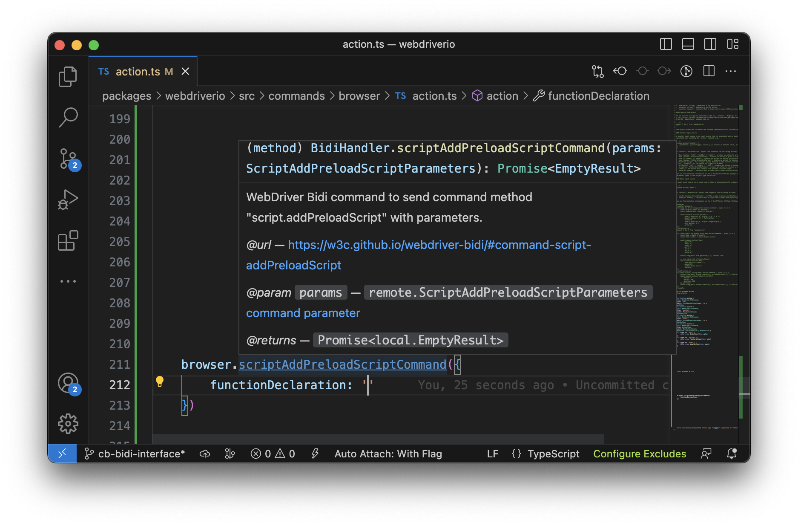

With the release of WebdriverIO v8 we introduced the ability to connect with the [WebDriver Bidi](https://w3c.github.io/webdriver-bidi/) protocol directly. This allowed users to access the new capabilities of the protocol in a rudimental way as its development progresses. Today, with every browser release more capabilities will be enabled, so it is time for WebdriverIO to step up its integration and make these easier accessible to the user.

With the release of WebdriverIO v8.11 we are adding new WebDriver Bidi interfaces and make them type safe 🎉

The interface of the WebDriver Bidi [specification](https://w3c.github.io/webdriver-bidi/) is defined through a [Concise Data Definition Language](https://www.rfc-editor.org/rfc/rfc8610.html) (short CDDL). It describes which payloads can be send to the driver and which responses are expected. Over the last month I've been working on a CDDL parser to help the [Browser Testing and Tools Working Group](https://www.w3.org/groups/wg/browser-tools-testing) at W3C to validate the CDDL defined in the specification as well as help the WebDriver ecosystem to adopt the protocol.

I've created two NPM packages that hopefully can contribute to that:

- [cddl](https://www.npmjs.com/package/cddl): a package to read CDDL and parse it into an AST as well as validate the contents
- [cddl2ts](https://www.npmjs.com/package/cddl2ts): a package that allows you to transform a CDDL file into a TypeScript interface that you can use for other TypeScript projects

With some recent changes in the WebdriverIO repository we now generate a perfectly typed WebDriver Bidi interface thanks to those packages, e.g.

We also updated the [protocol docs](/docs/api/webdriverBidi) to include new Bidi commands that help users to interact with the protocol using [Promises](https://developer.mozilla.org/en-US/docs/Web/JavaScript/Reference/Global_Objects/Promise). As browser start to support more Bidi features WebdriverIO will start running more automation on the new protocol, ensuring that your tests use the latest and greatest cross browser automation standards. Here are some features that are about to land in upcoming browser versions:

- [__Add Preload-Scripts__](https://w3c.github.io/webdriver-bidi/#command-script-addPreloadScript): this will be an invaluable command to help WebdriverIO mock Web APIs and inject scripts for introspection
- [__Network Interception__](https://github.com/w3c/webdriver-bidi/pull/429): this will make WebdriverIOs mock API for network requests compatible cross browser
- [__HTTP Authentication__](https://github.com/w3c/webdriver-bidi/issues/66): enables the ability to load a web page that is protected behind user credentials

Note that even WebdriverIO will offer the latest WebDriver Bidi features, this doesn't mean that those are implemented and shipped in the browser. Every browser vendor has different priorities and resources available to get these new features added and while the teams make great progress it will take more time until everything specified in the protocol lands in a stable browser version. You can be ensured though that WebdriverIO will always provide a typed interface for you to use them once ready.

Furthermore I am working on a proposal to extend the WebdriverIO interface and include a `page` object next to the already known `browser`, `element` and `mock` objects to simplify accessing commands and events connected to a certain browsing context. For information about that soon!

I want to close up thanking the Mozilla and Google browser teams for their excellent collaboration and efforts to ship this new standard that will enable developers around the world ship high quality web applications in the future.
