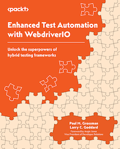

Embark on a transformative journey into the dynamic landscape of test automation with the compelling and instructive guide, "Enhanced Test Automation with WebdriverIO - Unlock the Superpowers of Hybrid Testing Frameworks." Authored with the dual purpose of empowering both newcomers and seasoned developers, this comprehensive book serves as an indispensable manual for mastering advanced WebdriverIO concepts, specifically tailored for end-to-end testing of web applications.

<!-- truncate -->

The book's rich content includes insights into the implementation of custom command wrappers and the integration of AI-powered self-healing object strategies, elevating the scope of test automation to unprecedented levels. Its target audience spans Software Developer Engineers in Test (SDETs) seeking to enhance their skill set. By addressing crucial aspects such as dynamic data handling, detailed reporting, and the seamless integration of automated tests into CI/CD pipelines, the book proves particularly beneficial for those striving to streamline test maintenance and automate complex test scenarios.

At the heart of this narrative is WebdriverIO, a leading automation testing framework. As readers navigate through the pages, they are introduced to the art of seamlessly integrating and balancing the strengths of various testing frameworks. The book strategically delves into the intricate realm of hybrid testing, demonstrating how the harmonious synergy of different frameworks can substantially enhance efficiency and reliability in the testing process.

### Here's a glimpse into what readers will uncover:

1. Efficient Page Object Model Maintenance:
   Discover techniques that empower you to efficiently maintain and enhance your Page Object Model, saving valuable time and effort in the long run.

2. Diagnosing and Resolving Script Instability:
   Gain insightful strategies for diagnosing and resolving script instability issues, ensuring a consistent and reliable test execution.

3. Building Resilient Test Objects:
   Learn how to build objects that exhibit adaptability to changing element locators, enhancing the overall resilience of your tests.

4. Enhancing Testing Productivity with TypeScript:
   Elevate your testing productivity by mastering the art of writing effective test cases with TypeScript, a powerful scripting language.

5. Comprehensive Result Analysis for Data-Driven Decision-Making:
   Explore strategies for conducting comprehensive result analysis, empowering data-driven decision-making processes within your testing framework.

6. Developing Adaptive Frameworks:
   Develop frameworks that seamlessly adapt to the evolving user journeys, ensuring the long-term sustainability of your tests.

Packed with practical examples, real-world scenarios, and expert insights, "Enhanced Test Automation with WebdriverIO" goes beyond traditional boundaries, equipping readers with the knowledge to revolutionize their test automation strategies. Whether you are a novice venturing into the automation journey or a seasoned professional looking to amplify your skills, this book serves as your gateway to unlocking the superpowers inherent in hybrid testing frameworks. Embrace the future of test automation and elevate your testing prowess with WebdriverIO.

You can get a copy of this book on [Amazon](https://www.amazon.com/Enhanced-Test-Automation-WebdriverIO-superpowers/dp/1837630186) today!
