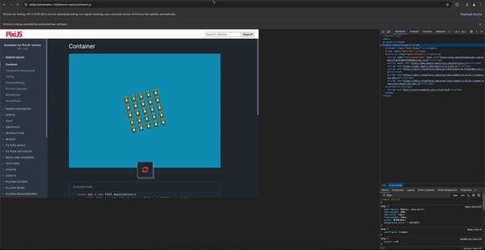

import Tabs from '@theme/Tabs';
import TabItem from '@theme/TabItem';

WebdriverIO is build to test various types of applications, from web or mobile applications towards native desktop apps or even VS Code extensions. But what about Chrome DevTools plugins? In this blog post we explore how one could interact with an extension build for Chrome Devtools.

<!-- truncate -->

# Interacting with Chrome DevTools from WebDriverIO: A Guide

One of WebDriverIO features is the ability to interact with Chrome DevTools, which can be extremely helpful for debugging and testing web applications and browser extensions. In this blog, we'll explore how to use WebDriverIO to interact with the Chrome DevTools, specifically focusing on interacting with the PixiJS extension.
You can find a complete example in [Github](https://github.com/gromanas/wdio-devtools-demo).

# Devtools in WebdriverIO v8

## Setting Up Extension

You need to download the extension you want to test in a `.crx` format,
in our case we have downloaded the `PixiJS-Devtools-Chrome-Web-Store.crx` extension file.

## Setting Up WebDriverIO

First, ensure you have WebDriverIO set up in your project. If not, you can install it by following the official installation guide [here](https://webdriver.io/docs/gettingstarted#initiate-a-webdriverio-setup)

## WebDriverIO Configuration for Chrome DevTools

Here is the configuration file (`wdio.conf.js`) tailored to our example:

```javascript
import path from "path";
import fs from "fs";

export const config = {
  specs: ["./test/specs/**/*.js"],
  runner: "local",
  maxInstances: 1,
  capabilities: [
    {
      browserName: "chrome",
      browserVersion: "stable",
      "goog:chromeOptions": {
        args: [
          "ignore-certificate-errors-spki-list",
          "--ignore-certificate-errors",
          "window-size=1920,1080",
          "--auto-open-devtools-for-tabs",
        ],
        extensions: [
          fs.readFileSync(
            path.resolve("./PixiJS-Devtools-Chrome-Web-Store.crx"),
            "base64"
          ),
        ],
      },
    },
  ],
  logLevel: "debug",
  framework: "mocha",
  mochaOpts: {
    ui: "bdd",
    timeout: 1000 * 60 * 5, // 5 min
  },
};
```

In this configuration, we specify the Chrome browser with options to auto-open DevTools for tabs and load the PixiJS DevTools extension. The `extensions` option reads the extension file in base64 format.
We need also the `--auto-open-devtools-for-tabs` flag to automatically open the DevTools (Developer Tools) panel.

## Writing the Test Script

Next, we write a test script to interact with the PixiJS extension through Chrome DevTools. Create a test file, for example, `devtools.test.js`, and add the following code:

<Tabs
defaultValue="webdriver"
values={[
{label: 'WebDriver primitives', value: 'webdriver'},
{label: 'Puppeteer', value: 'puppeteer'},
]}
>

<TabItem value="webdriver">

```javascript
import { $, browser } from "@wdio/globals";
import { Key } from "webdriverio";

describe("DevTools Test on latest chrome", function () {
it("Devtools Navigation", async function () {
// Open an example game.
await browser.url(
"https://pixijs.io/examples-v5/#/demos-basic/container.js"
);

    // Get window handles.
    const handles = await browser.getWindowHandles();

    // Switch to devtools window.
    await browser.switchToWindow(handles[1]);

    // Navigate through devtool tabs.
    // For linux machines use [Key.Control, '['] .
    await browser.keys([Key.Meta, "["]);

    // Switch to devtool extension iframe.
    await browser.switchToFrame(0);

    // Manipulate extension.
    await $(
      "body > div > div > div.status.svelte-iqeeoq > div.patch.svelte-iqeeoq > button"
    ).click();
    await $(
      "body > div > div > div.outliner.svelte-iqeeoq > div > div.body.svelte-1vjyr8f > div:nth-child(1) > button:nth-child(4)"
    ).click();
    await $(
      "body > div > div > div.outliner.svelte-iqeeoq > div > div.body.svelte-1vjyr8f > div:nth-child(1) > button:nth-child(4)"
    ).click();

    // Switch back to parent frame.
    await browser.switchToParentFrame();

    // Switch back to main window.
    await browser.switchToWindow(handles[0]);
});
});
```

### Explanation of the Script

1. **Open a URL:** The script navigates to an example PixiJS game.
2. **Get Window Handles:** Retrieves the window handles for the main window and the DevTools window.
3. **Switch to DevTools Window:** Switches context to the DevTools window using its handle.
4. **Navigate DevTools Tabs:** Uses keyboard shortcuts to navigate through DevTools tabs. Note: For Linux, replace `['Meta', '[']` with `['Control', '[']`.
5. **Switch to Iframe:** Switches to the iframe that contains the PixiJS extension.
6. **Interact with the Extension:** Performs clicks on specific elements within the extension.
7. **Switch Back:** Returns to the parent frame and then back to the main window.

</TabItem>

<TabItem value="puppeteer">

```javascript
import { browser } from "@wdio/globals";

describe("Devtools using Puppeteer", function() {
    it("Devtools Navigation", async function() {
        // Open an example game.
        await browser.url("https://pixijs.io/examples-v5/#/demos-basic/container.js");
        await browser.pause(2000);

        // Get puppeteer instance from browser
        const puppeteer = await browser.getPuppeteer();

        // Get all targets from the current window
        const targets = puppeteer.targets();

        // Filter all targets and select the one starts from 'devtools://'
        const devtoolsTarget = targets.find(t => t.url().includes('devtools://'));

        // Devtools target type is 'other' and we change (we actually hack it) the type to 'page'
        // in order to be able to interact with and expose it's DOM
        // NOTE: you can refer to this page https://pptr.dev/api/puppeteer.target.aspage/
        const devtoolsPage = await devtoolsTarget.asPage();
        await devtoolsPage.bringToFront();

        // Navigate through Devtools tabs.
        // For linux machines use ['Control', '['] .
        await devtoolsPage.keyboard.down('Meta');
        await devtoolsPage.keyboard.press('[');
        await devtoolsPage.keyboard.up('Meta');

        // Get all the iframes from Devtools window related with the current open tab
        const frames = devtoolsPage.frames();

        // Switch to devtool extension iframe.
        const iframe = await frames[1];

        await browser.pause(2000);

        // Use puppetter commands to execute some expressions directly in the Devtools extensions window
        // NOTE: https://pptr.dev/api/puppeteer.page.evaluate
        await iframe.evaluate(() => {
            var xpath = '/html/body/div/div/div[2]/div[1]/button';
            var result = document.evaluate(xpath, document, null, XPathResult.FIRST_ORDERED_NODE_TYPE, null);
            result.singleNodeValue.click();
        });

        await browser.pause(2000);

        await iframe.evaluate(() => {
            var xpath = '/html/body/div/div/div[1]/div/div[2]/div[1]/button[3]';
            var result = document.evaluate(xpath, document, null, XPathResult.FIRST_ORDERED_NODE_TYPE, null);
            result.singleNodeValue.click();
        });

        await browser.pause(2000);

        await iframe.evaluate(() => {
            var xpath = '/html/body/div/div/div[1]/div/div[2]/div[1]/button[3]';
            var result = document.evaluate(xpath, document, null, XPathResult.FIRST_ORDERED_NODE_TYPE, null);
            result.singleNodeValue.click();
        });

        await browser.pause(2000);
    });
});
```
### Explanation of the Script

## Overview

This script performs several actions using Puppeteer to interact with a PixiJS game through the browser's DevTools. The steps involved include opening a URL, retrieving and filtering targets, navigating DevTools tabs, and interacting with a PixiJS extension.

## Detailed Steps

1. **Open a URL:** The script navigates to an example PixiJS game.
2. **Get Puppeteer Instance:** Retrieves the Puppeteer instance from the browser.
3. **Get All Targets:** Retrieves all the targets from the current window. Targets in Puppeteer represent different contexts within the browser, such as pages, iframes, or service workers.
4. **Filter DevTools Target:** Filters the targets to find the one starting with `devtools://`.
5. **Hack Target Type:** Changes the target type to `page` to interact with and expose its DOM. This ensures that the target can be manipulated and inspected as a regular web page.
6. **Get DevTools Page:** Retrieves the page, including its DOM, elements, selectors, etc., from the DevTools target. This allows interaction with the elements within DevTools.
7. **Navigate DevTools Tabs:** Uses keyboard shortcuts to navigate through DevTools tabs. On Linux, replace `['Control', '[']` with `['Meta', '[']`.
8. **Get All Iframes:** Retrieves all the iframes from the DevTools window related to the current open tab.
9. **Switch to DevTools Extension Iframe:** Switches to the iframe containing the PixiJS extension.
10. **Interact with the Extension:** Uses Puppeteer commands to execute expressions directly in the DevTools extension window. This step facilitates interaction with the PixiJS extension.

</TabItem>
</Tabs>

## Running the Test

To run the test, execute the following command:

```sh
npx wdio run wdio.conf.js
```

This will launch Chrome, open the specified URL, interact with the DevTools, and manipulate the PixiJS extension as defined in the test script.

#### Demonstration



## Conclusion

By leveraging WebDriverIO and Chrome DevTools, you can automate complex browser interactions and extension manipulations. This approach is beneficial for testing web applications and ensuring extensions like PixiJS work correctly across different scenarios.

Feel free to modify the script to fit your specific testing needs. Happy testing!
