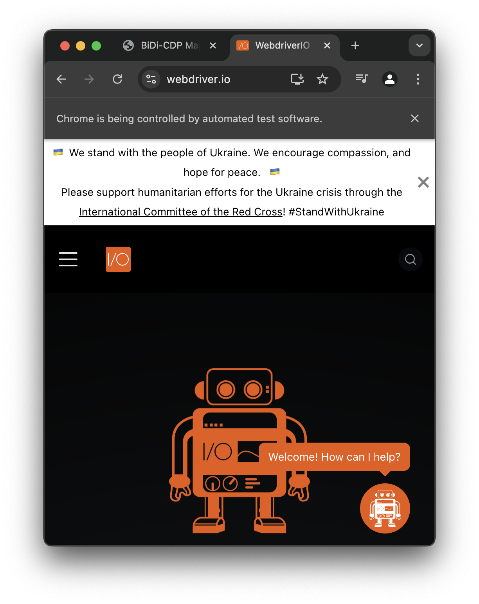
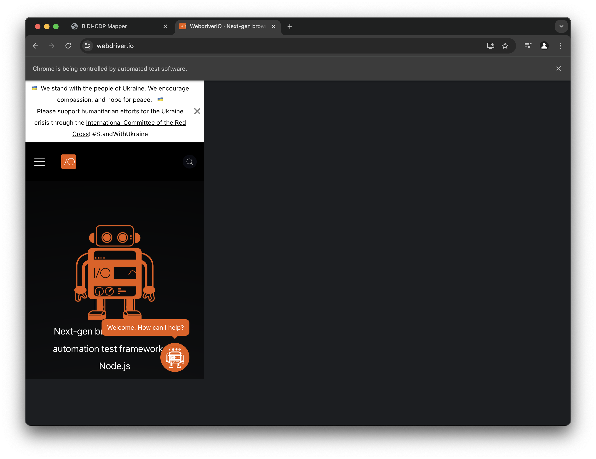

The whole Webdriverio development team is stoked and proud to release WebdriverIO v9 today!

This marks the beginning of a new exciting era for all projects using WebdriverIO as their test automation tool. With the great work of browser teams that are working on e.g. Chrome and Firefox, we now enter a new era that offers much greater automation capabilities than ever before thanks to the new [WebDriver Bidi](https://w3c.github.io/webdriver-bidi/) protocol. With WebdriverIO v9 we have been working to be at the forefront of adopters of this new era and allow you to leverage from the power of the protocol first.

<!-- truncate -->

Let's explore the new features, updates, and optimizations in this release.

## New Features

The majority of the new features in v9 are enabled by the WebDriver Bidi capabilities now available in browsers. Upon upgrading to v9, all sessions will automatically use Bidi unless you explicitly disable it via the new `wdio:enforceWebDriverClassic` capability.

:::note

These features unfortunately won't be available to you if your remote environment doesn't support WebDriver Bidi. You can check if Bidi is support in your session by looking into the `browser.isBidi` property.

:::

### New `url` Command Parameters

The `url` command has evolved from a simple navigation tool to a powerful feature-packed command.

#### Passing in Custom Headers

You can now pass custom headers that will be applied when the browser makes a request. This is useful for setting session cookies to log in automatically.

```ts
await browser.url('https://webdriver.io', {
    headers: {
        Authorization: 'Bearer XXXXX'
    }
});
```

Note that while you can modify how the browser treats all requests through the [`mock`](/docs/api/browser/mock) command, changes applied to the [`url`](/docs/api/browser/url) command only last for that particular page load and reset once navigation is complete.

#### Overcome Basic Authentification

Automating user authentication via [basic authentication](https://en.wikipedia.org/wiki/Basic_access_authentication) has never been easier:

```ts
await browser.url('https://the-internet.herokuapp.com/basic_auth', {
    auth: {
        user: 'admin',
        pass: 'admin'
    }
});
await expect($('p=Congratulations! You must have the proper credentials.').toBeDisplayed();
```

#### Running an Initialization Script

Inject JavaScript before anything loads on the website using the `beforeLoad` parameter. This is useful for manipulating Web APIs, e.g.:

```ts
// navigate to a URL and mock the battery API
await browser.url('https://pazguille.github.io/demo-battery-api/', {
    onBeforeLoad (win) {
        // mock "navigator.battery" property
        // returning mock charge object
        win.navigator.getBattery = () => Promise.resolve({
            level: 0.5,
            charging: false,
            chargingTime: Infinity,
            dischargingTime: 3600, // seconds
        })
    }
})
// now we can assert actual text - we are charged at 50%
await expect($('.battery-percentage')).toHaveText('50%')
// and has enough juice for 1 hour
await expect($('.battery-remaining')).toHaveText('01:00)
```

In this example, we overwrite the [`getBattery`](https://developer.mozilla.org/en-US/docs/Web/API/Navigator/getBattery) method of the `Navigator` interface.

### New `addInitScript` Command

The `addInitScript` command enables you to inject a script into the browser that is triggered every time a new browsing context is opened. This includes actions such as navigating to a URL or loading an iframe within an application. The script you pass to this command receives a callback as its last parameter, allowing you to send values from the browser back to your Node.js environment.

For instance, to get notified whenever an element is added or removed from a node in the application, you can use the following example:

```ts
const script = await browser.addInitScript((myParam, emit) => {
    const observer = new MutationObserver((mutations) => {
        for (const mutation of mutations) {
            emit(mutation.target.nodeName)
        }
    })
    observer.observe(document, { childList: true, subtree: true })
})

script.on('data', (data) => {
    console.log(data) // prints: BODY, DIV, P, ...
})
```

This initialization script can modify global variables and overwrite built-in Web API primitives, allowing you to configure the test environment to meet your specific requirements.

### Cross Browser Request Mocking

WebdriverIO introduced request mocking in [`v6.3.0`](https://github.com/webdriverio/webdriverio/blob/v6/CHANGELOG.md#rocket-new-feature-14), limited to Chromium browsers. With v9, we now use WebDriver Bidi, extending support to all browsers. This enhancement allows modifying requests before they go out to the network:

```ts
// mock all API requests
const mock = await browser.mock('**/api/**')
// apply auth token to each request
mock.request({
    headers: { 'Authorization': 'Bearer XXXXXX' }
})
```

### Automatic Shadow Root Piercing

Testing applications with Web Components is now seamless with automatic shadow root piercing. WebdriverIO now keeps track of all [`ShadowRoot`](https://developer.mozilla.org/en-US/docs/Web/API/ShadowRoot) nodes and searches across them.

For example, let's say we want to automate the following Date Picker component that contains multiple nested shadow roots, take a look with `Right Click > Inspect` on any of the elements in the application and observe how much they are nested within different shadow roots:

<PhoneMock>
    <iframe title="Date Picker" height="580" style={{ paddingTop: '40px' }} width="292px" src="https://ionicframework.com/docs/usage/v8/datetime/basic/demo.html?ionic:mode=md"></iframe>
</PhoneMock>

In order to change the date, you can now just call:

```ts
await browser.url('https://ionicframework.com/docs/usage/v8/datetime/basic/demo.html?ionic:mode=md')
await browser.$('aria/Sunday, August 4]').click()
await browser.$('.aux-input').getValue() // outputs "2024-08-04T09:00:00"
```

While WebdriverIO previously supported ["deep selectors"](/docs/selectors#deep-selectors), this functionality was limited to CSS selectors. The new selector engine now supports all selector types, including accessibility labels.

With the enhanced locator engine, elements within multiple nested shadow roots can be easily found. WebdriverIO is the first framework to support this capability for shadow roots in both `open` and `closed` mode.

### Improved Argument Serialization

With WebDriver Classic the ability to move data objects from the Test to the browser environment was rather limited to DOM elements and serializable objects and types. With WebDriver Bidi we are now able to do a better job transforming non-serializable data objects to be used in the browser as the object that it is. Alongside known JavaScript primitives such as `Map` or `Set`, the protocol allows to serialize values such as `Infinity`, `null`, `undefined` and `BigInt`.

Here is an example where we compose a JavaScript Map object in Node.js and pass it over to the browser where it gets automatically deserialzed back into a Map and vise versa:

```ts
const data = new Map([
    ['username', 'Tony'],
    ['password', 'secret']
])
const output = await browser.execute(
    (data) => `${data.size} entrie(s), username: ${data.get('username')}, password: ${data.get('secret')}`,
    data
)

console.log(output)
// outputs: "1 entrie(s), username: Tony, password: secret"
```

This will make it easier pass data along and work with custom scripts that can now return rich data objects that will help better observe the state of your application. It will allow frameworks like WebdriverIO to integrate deeper with the browser environment and build more useful features in the future.

### Setting Viewports

While WebdriverIO allows you to test your application in both desktop and mobile browsers, it is often easier to emulate a mobile user by adjusting the browser viewport to check if the application renders properly in responsive mode. With WebDriver Classic, this can be challenging because browser windows cannot scale down to very small sizes and often maintain a minimum width of `500px`. For example:

```ts
await browser.url('https://webdriver.io')
await browser.setWindowSize(393, 659)
console.log(await browser.execute(() => window.innerWidth)) // returns `500`
```



WebdriverIO v9 introduces the `setViewport` command, enabling you to adjust the application’s viewport to any size, including modifying the `devicePixelRatio`. Unlike `setWindowSize`, which changes the overall browser window size, `setViewport` specifically resizes the canvas where the application is rendered, leaving the browser window dimensions unchanged.

To simplify mobile device emulation, we’ve enhanced the emulate command. This new capability allows you to simultaneously adjust the viewport size, device pixel ratio, and user agent for a specific mobile device by simply specifying its name. For example:

```ts
await browser.url('https://webdriver.io')
await browser.emulate('device', 'iPhone 15')
console.log(await browser.execute(() => window.innerWidth)) // returns `393`
console.log(await browser.execute(() => navigator.userAgent)) // returns `Mozilla/5.0 (Macintosh; Intel Mac OS X 10_15_7) AppleWebKit/537.36 (KHTML, like Gecko) Chrome/127.0.0.0 Safari/537.36`
```



While we recommend to run mobile testing on actual mobile devices, as mobile browser engines differ from the ones used for desktop browser, this can be an easy escape hatch if we just quickly want to verify how the application renders in mobile viewports.

### Fake Timers Support

Want to change the time in the browser? With WebdriverIO v9, it's now possible to fake the time within the browser for your tests. We've enhanced the [`emulate`](/docs/emulation) command with a new property: `clock`. This allows you to set the date and time to whatever you need and control when time should advance. Here's how it works:

```ts
const clock = await browser.emulate('clock', { now: new Date(2021, 3, 14) })
console.log(await browser.execute(() => new Date().getTime())) // returns 1618383600000

await clock.tick(1000)
console.log(await browser.execute(() => new Date().getTime())) // returns 1618383601000
```

The new `clock` emulation returns a [`Clock`](/docs/api/clock) object with methods like `tick`, `setSystemTime`, and `restore` for precise control over the time in your tests.

### Automatic Dialog Handling

If your application works with native browser dialogs, e.g. `alert` or `confirm`, it sometime can be tricky when these prompts show up unexpectedly. In previous versions all commands would fail if you don't handle them properly. With WebdriverIO v9 we will start automatically suppressing dialogs, unless you explicitly register a listener to it, e.g.:

```ts
await browser.url('https://webdriver.io')
browser.on('dialog', async (dialog) => {
    console.log(dialog.message()) // outputs: "Hello Dialog"
    await dialog.dismiss()
})

await browser.execute(() => alert('Hello Dialog'))
```

The new `dialog` event gets a [dialog](/docs/api/dialog) object passed in that allows you to call `accept` or `dismiss` on it, get the type or message of the dialog as well as its default value. We hope this will break less tests in the future due to unexpected alerts by the browser.

### Automatic waiting for elements to become interactable

An element is considered not to be interactable when it is either not displayed, cannot be scrolled into the viewport or is disabled and previously WebdriverIO would would throw an error when this would happen. In v8 we already made an improvement of showing the html of the element but in v9 we now automatically wait for elements to become interactable when executing a direct action on the element, like a click or using setValue!

This means that you no longer need to write code like this:
```ts
const submitButton = await $('button[type="submit"]');
await submitButton.waitForEnabled(); // validation of the form takes time, during which the button is disabled
await submitButton.click();
```

Instead you can now slim this down to:
```ts
const submitButton = await $('button[type="submit"]');
await submitButton.click(); // automatically waits for the button to become enabled
```

### Snapshot Testing of Web Components

If your application uses a lot of web components, using the snapshot feature turned out to be not possible due to the fact that WebdriverIO struggled to look inside the [Shadow Root](https://www.google.com/search?q=shadow+root+mdn&sourceid=chrome&ie=UTF-8). With v9 WebdriverIO has now total visibility into all elements an allows to snapshot open and closed web components by transforming them into a [Declarative Shadow DOM](https://web.dev/articles/declarative-shadow-dom), e.g.:

```ts
await browser.url('https://ionicframework.com/docs/usage/v8/button/basic/demo.html?ionic:mode=md')

// get snapshot of web component without its styles
const snapshot = await $('ion-button').getHTML({ excludeElements: ['style'] })

// assert snapshot
await expect(snapshot).toMatchInlineSnapshot(`
    <ion-button class="md button button-solid ion-activatable ion-focusable hydrated">Default
        <template shadowrootmode="open">
            <button type="button" class="button-native" part="native">
            <span class="button-inner">
                <slot name="icon-only"></slot>
                <slot name="start"></slot>
                <slot></slot>
                <slot name="end"></slot>
            </span>
            <ion-ripple-effect role="presentation" class="md hydrated">
                <template shadowrootmode="open"></template>
            </ion-ripple-effect>
            </button>
        </template>
    </ion-button>
`)
```

To enable this feature we enhanced the `getHTML` command and replaced its previous boolean parameter with an object that allows better control about the command behavior. Read more about the new `GetHTMLOptions` options in the [`getHTML`](/docs/api/element/getHTML) command docs.

## Notable Breaking Changes

We strive to minimize breaking changes to avoid requiring significant time for upgrades to the latest version of WebdriverIO. However, major releases offer an opportunity to remove deprecated interfaces that we no longer recommend using.

### Accessing Element Properties

As you know, WebdriverIO allows you to fetch elements from the browser to interact with them in your tests. When you interact with an element, WebdriverIO holds a reference and additional metadata on the element to properly direct commands to the correct element and, for example, refetch an element if it becomes stale. You may have accessed some of these element properties, such as evaluating the selector via `$('elem').selector` or getting its reference via `$('elem').elementId`, among [others](/docs/api/element#properties).

These properties are no longer accessible in this manner. Instead, you need to call [`getElement`](/docs/api/element/getElement) to access properties of `WebdriverIO.Element` and [`getElements`](/docs/api/element/getElements) to access properties for a `WebdriverIO.ElementArray`. Here is an example:

```ts
// WebdriverIO v8 and older
const elem = await $('elem')
console.log(elem.selector) // ❌ returns a `Promise<string>` now

// WebdriverIO v9
const elem = await $('elem').getElement()
console.log(elem.selector) // ✅ returns "elem"
```

This change fixes a [very annoying bug](https://github.com/webdriverio/webdriverio/issues/12591) in IDEs that were misled into believing that `$('elem')` returns a promise, causing them to automatically wrap chained element calls in multiple `await` statements, e.g., `await (await $('elem')).getText()`. This improvement will make writing tests much easier.

### Removal of `XXXContaining` Matcher

In `expect-webdriverio`, we maintain custom matchers tailored for WebdriverIO elements and end-to-end testing scenarios. Previously, we provided `XXXContaining` versions of each matcher to allow partial value matching. However, the underlying [`expect`](https://www.npmjs.com/package/expect) package already supports this functionality via [asymmetric matchers](https://jestjs.io/docs/expect#asymmetric-matchers). To reduce the number of matchers we maintain, we have decided to remove our custom `XXXContaining` matchers in favor of using these asymmetric matchers.

Migrating to asymmetric matchers is straightforward. Here is an example:

```diff
- await expect($('elem')).toHaveTextContaining('Hello')
+ await expect($('elem')).toHaveText(expect.stringContaining('Hello'))
```

### Removal of `isDisplayedViewport`

We have removed the `isDisplayedViewport` command and merged the functionality with the `isDisplayed` command, e.g.:

```patch
- await $('element').isDisplayedViewport()
+ await $('element').isDisplayed({ withinViewport: true })
```

### Removal of JSON Wire Protocol Commands

The JSON Wire Protocol was the first automation protocol developed by Selenium, enabling remote browser automation using any language that supports HTTP. In 2012, the creators of Selenium began working on formally standardizing the protocol, which is now supported in all browsers. This effort culminated in the WebDriver protocol becoming a W3C Recommendation, leading browser drivers and cloud vendors to migrate to this official standard.

We believe it is time to say farewell to the old JSON Wire Protocol and embrace the WebDriver future. If you are still testing on older browsers and require these protocol commands for your automation scripts, you can install the [`@wdio/jsonwp-service`](https://www.npmjs.com/package/@wdio/jsonwp-service) to continue using the necessary commands.

### Removal of `devtools` and `@wdio/devtools-service` Packages

With WebdriverIO `v8.15`, we [introduced](https://webdriver.io/blog/2023/07/31/driver-management) an automatic setup for browser drivers as a core feature. This change rendered the original purpose of the [`devtools`](https://www.npmjs.com/package/devtools) package obsolete. Initially, the devtools package was designed to implement the WebDriver specification through Puppeteer which handles the browser setup for you. This allowed using WebdriverIO without having to download any browser driver. As this functionality is no longer needed, we have decided to remove the `devtools` package along with the `automationProtocol` option.

Furthermore, with the adoption of WebDriver Bidi, we now have a standardized protocol for most of our automation needs. Despite this, using [Chrome Devtools](https://developer.chrome.com/docs/devtools) for more complex browser introspection has been a popular feature in WebdriverIO. Previously, we recommended the `@wdio/devtools-service` package for these use cases. However, we found that most users prefer to use [Puppeteer](https://pptr.dev/) directly rather than our custom DevTools interfaces. WebdriverIO users can automate the browser using WebdriverIO primitives as well as Puppeteer simultaneously. By calling the `getPuppeteer` command, you can obtain a Puppeteer instance for the browser you are automating, granting you access to all Devtools capabilities through a more robust and maintained interface. As a result, users primarily utilize the `@wdio/devtools-service` package for testing performance and other [Google Lighthouse](https://developer.chrome.com/docs/lighthouse/overview) features. Moving on, these features will be available under a new service package called [`@wdio/lighthouse-service](https://www.npmjs.com/package/@wdio/lighthouse-service).

Rest assured, we have already found a good use case for these packages and will not abandon them.

## Project Updates

While we have been diligently adding new features to make WebdriverIO more effective for testing web and mobile applications, we have also been focusing on several internal initiatives to ensure a bright future for the project.

### pnpm Migration

As our core packages have grown over time, we've faced increasing challenges with NPM, particularly with dependency resolution in our monorepo. Additionally, custom linking made our testing infrastructure more complex than necessary.

Given the evolving JavaScript tooling ecosystem, we evaluated and adopted new technologies to improve the developer experience within the project. By migrating to pnpm, we eliminated many custom scripts, simplified the overall project setup, and now enjoy faster, more reliable dependency resolution with fewer merge conflicts in our regular updates via Dependabot.

### Esbuild Migration

Since introducing TypeScript in [`v7`](https://github.com/webdriverio/webdriverio/blob/v7/CHANGELOG.md#boom-breaking-change-1), we've used the TypeScript compiler to convert files into JavaScript for publishing to NPM. However, as our codebase grew, we encountered challenges with this setup. For example, some files within the `webdriverio` or `@wdio/browser-runner` packages are exclusively used in browser environments, yet they were compiled as if for Node.js, causing compatibility issues.

With WebdriverIO v9, all project files are compiled with Esbuild. This versatile and ultra-fast bundler allows us to compile code specifically for the intended environment, ensuring the right polyfills are applied. Additionally, every package is now bundled into a single JavaScript file, slightly improving performance, especially for component testing.

### Migration from `ts-node` to `tsx`

WebdriverIO has transitioned from `ts-node` to `tsx` for compiling TypeScript tests into JavaScript at runtime. This change offers better ESM support, improved performance, and more accurate stack traces for errors in TypeScript tests.

### Dropping Node.js v16 Support

As with every release, we are discontinuing support for older, unmaintained Node.js versions. WebdriverIO v9 will no longer support Node.js v16 and below. We recommend users upgrade to Node.js v20.

## What's Next?

As WebdriverIO celebrates its 13th year of development, the need for new testing capabilities continues to grow alongside the evolving testing industry and web standards. With the adoption of the WebDriver Bidi protocol in modern browsers, tools like Selenium, Nightwatch, and WebdriverIO can match the power of Playwright and Cypress without relying on proprietary browser patches or specific execution environments.

WebdriverIO will continue to integrate more WebDriver Bidi features to build powerful new functionalities. We are excited about future developments, including a WebdriverIO devtools application that will significantly enhance the testing experience by providing a powerful UI for inspecting and debugging the application under test. More details on this initiative will be shared soon!

### Acknowledgments

We extend our gratitude to our Premium Sponsors, [BrowserStack](https://www.browserstack.com/) and [Sauce Labs](https://saucelabs.com/), and to everyone who contributes to the project. WebdriverIO remains community-driven and independent, relying on contributions from people like you. Join our [Open Office Hours](https://webdriver.io/community/openofficehours) and consider giving back to the project.

Here's to many more years of innovation and collaboration! 🚀

Thank you for reading!
