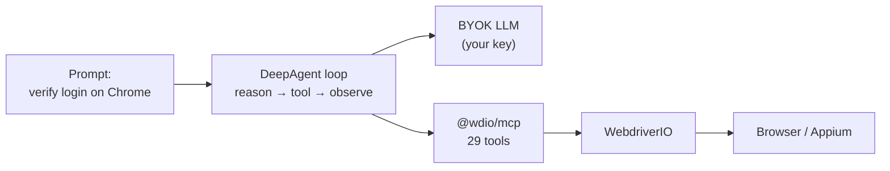

It's late, CI just went red, and all you've got is a trace zip and a failing selector. Over the last two posts we gave you the pieces: [the MCP server](/blog/2026/02/04/introducing-webdriverio-mcp) gave your AI assistant hands to drive browsers and phones, and [trace mode](/blog/2026/06/18/webdriverio-tracing) gave your tests a black box: every click, request, and screenshot. Hands and hindsight. But hands need direction, and recordings need a reader.

That's what a harness is for: `@wdio/deepagent` reads the box and moves the hands, giving you something that doesn't just follow a prompt or record a failure but *thinks* about it: reasons, acts, retries, and fixes the test when it breaks.

This is the last mile: an autonomous agent that runs WebdriverIO and heals it while keeping you in the loop where it counts. Approvals gate every write; CI mode goes unattended only when you say so.

<!-- truncate -->

## What Is DeepAgent

A **bring-your-own-key** agent harness built on LangChain's [Deep Agents](https://docs.langchain.com/oss/javascript/deepagents/overview). It wires an LLM into a LangChain agent loop that drives the app under test through the `@wdio/mcp` tool surface, and it turns devtools trace artifacts into reproducible, healable runs.

Important framing: this is an AI harness **on top of** WebdriverIO, not a replacement for it. `$("#submit").click()` still executes in your framework, under your rules. The agent just decides *what* to call at each step. The same surface can even be served to Claude via `wdio-deepagent mcp`.



## Quick Start

Install it, then generate a config that's correct for your framework:

```sh
npm i -D @wdio/deepagent
npx wdio config   # select the @wdio/deepagent plugin → pick an LLM provider
```

The wizard writes a `deepagent` block into your `wdio.conf.ts` (and adds the devtools service for diagnostic traces):

```ts
export const config = {
    // ...framework/services as usual...
    deepagent: {
        llm: { provider: 'openrouter', model: 'moonshotai/kimi-k3' },
    },
}
```

Set your key, and you're off:

```sh
export OPENROUTER_API_KEY=sk-…        # or OPENAI_API_KEY / ANTHROPIC_API_KEY

wdio-deepagent repl                   # interactive session
wdio-deepagent run "Verify the login flow on Chrome and report failures"
wdio-deepagent diagnose test-results/trace-<session>.zip --spec test/specs/login.e2e.js
```

Prefer a config file over env vars? `DEEPAGENT_MODEL=openrouter:moonshotai/kimi-k3` and `DEEPAGENT_HEAL=ask` skip the file block entirely.

## The Agent Loop

Pick the brain, plug in the hands. The model resolver maps one zod schema onto the matching LangChain integration: swap providers with a flag, not a refactor:

```sh
wdio-deepagent run "..." --model ollama:qwen3:8b          # local, no key
DEEPAGENT_MODEL=anthropic:claude-3-7-sonnet wdio-deepagent repl
```

Underneath, each turn is the classic loop: model → tool call → observe → repeat. The MCP client exposes the 29-tool `@wdio/mcp` surface (`navigate`, `get_elements`, `click_element`, `set_value`, `get_screenshot`, …), plus test-native tools (`run_spec`), trace tools (`ingest_trace`, `reproduce_spec`, `diff_traces`), and a site knowledge base (`remember_snapshot`, `query_knowledge_base`). A natural-language mission unfolds as plain tool calls:

```
"Open webdriver.io, click Get Started, and screenshot the page."

  1. start_session({ browser: 'chrome' })
  2. navigate({ url: 'https://webdriver.io' })
  3. get_elements()                 → returns ready-to-use selectors
  4. click_element({ selector: 'a.get-started' })
  5. get_screenshot()               → visual check
  6. final answer with evidence
```

Turns stream token-by-token through deepagents' v3 streaming engine, with a token budget (`maxTokens`, default 8192) and a **loop guard**: three consecutive identical tool calls are met with an explicit *"this is the Nth identical call — it has not worked and will not work on retry"* error, and recursion is capped at 300. Loops get caught, not recited.

## Self-Healing

This is the payoff from the tracing post. When a test fails in CI, you ship the trace zip to the agent:

```sh
wdio-deepagent diagnose test-results/trace-a1b2c3.zip \
  --heal ask \
  --spec test/specs/login.e2e.js
```

The trace reader parses the Vibium-format archive, covering the action timeline, network errors, `transcript.md`, screenshots, and DOM/a11y snapshots, then reproduces the failing spec under a trace-mode overlay, diffs old vs new runs, and hands the whole picture to the LLM. Then the modes kick in:

- **`ask`** (default): the agent proposes fixes; *every* write is gated by a human approval prompt.
- **`propose`**: filesystem is read-only; you get a diff, nothing else.
- **`auto`**: unattended CI healing of specs and page objects. Never config, never secrets.

Each fix attempt re-runs the spec to verify (`maxHealAttempts`, default 2, min 1). `verification.healed` tells you the edit actually fixed the run, while `healAttempts` records how many tries it took.

## The REPL

`wdio-deepagent repl` is an Ink-based (React-for-terminal) UI: streamed replies, bordered tool-call cards, a status footer that tracks tokens and turn time, and an approval picker in `ask` mode. It's autopilot with a seatbelt:

```
wdio> Verify the login flow on Chrome
  ┌─ run_spec ────────────────────────────────┐
  │ spec: test/specs/login.e2e.js             │
  │ status: running                           │
  └───────────────────────────────────────────┘
  ┌─ approve edit? ───────────────────────────┐
  │ write_file /test/specs/login.page.js      │
  │ [y/N]                                     │
  └───────────────────────────────────────────┘
  wdio> exit
```

`close session`/`reset` recycle the browser without quitting; Ctrl-C cancels a turn or exits when idle. No TTY, no problem: `wdio-deepagent run "<prompt>" --heal auto` is the fully unattended CI path.

## Safety Guardrails

Agents get constraints. Ours ship with several layers:

- **Token budget**: `maxTokens` defaults to 8192, `temperature` to 0.1. Small models (≤7B) get a warning: the MCP tool schemas alone cost ~8–10k tokens per session.
- **Permission deny-lists**: write access to `wdio.conf*`, `.github/**`, `package.json`, lockfiles, `.env*`, key material, `node_modules` is denied in *every* heal mode. Proposed writes to denied paths never even reach the human prompt.
- **Zip limits**: a crafted `trace.zip` can't exhaust memory: 10,000 entries / 256 MiB decompressed cap, and oversized entries are refused before extraction.
- **Loop guard + interrupt rounds**: identical-call detection and a 5-round cap on approval resumes keep a spinning model from running forever.

Nothing here depends on the model being well-behaved. The harness contains the behavior.

## What's Next

The trilogy closes, the story continues. One thing's done; two are directions we're exploring:

1. **Cloud execution** is already shipped, so it's not future work and not even comparable to "MCP cloud". Cloud providers landed in `@wdio/mcp` back in 3.2.0 ([Cloud providers docs](/docs/mcp/cloud-providers)), and DeepAgent specs run through your `wdio.config` via `run_spec`, `reproduce`, and `diagnose`, with no MCP involvement. If your `wdio.config` already targets a cloud provider, DeepAgent runs there today.
2. **Multi-agent collaboration** is exploratory, not a roadmap: a spec-fixer, a flake-hunter, and a docs-scraper that don't share one context window, but do share a plan and a knowledge base. Could that division of labor beat one oversized context? We'd love to find out.
3. **Coverage-driven test generation** is also exploratory. The site knowledge base already accumulates a11y snapshots per page; the leap would be letting coverage gaps *request* new specs. The coverage tooling doesn't exist yet.

Those last two are directions, not promises.

## Learn More

- [DeepAgent docs](/docs/deepagent) — full configuration, commands, and heal-mode reference
- [MCP docs](/docs/mcp) — the 29-tool browser/mobile surface the agent drives
- [DevTools Service docs](/docs/wdio-devtools-service) — trace mode and the Vibium recording format
- [`create-wdio`](/docs/gettingstarted) — `npx wdio config` scaffolding, deepagent included

Questions or feedback? Find us on [Discord](https://discord.webdriver.io).

Happy healing!