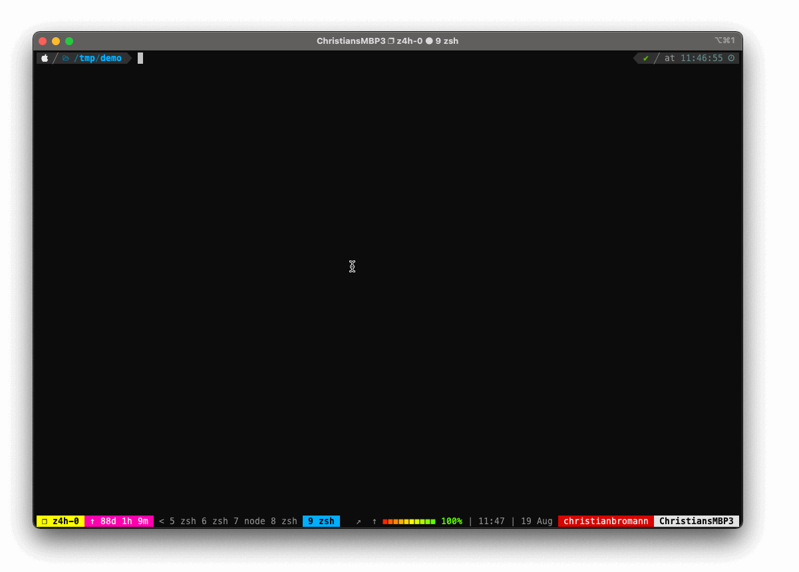

Welcome to the WebdriverIO documentation. It will help you to get started fast. If you run into problems, you can find help and answers on our [Gitter Channel](https://gitter.im/webdriverio/webdriverio) or you can hit me on [Twitter](https://twitter.com/webdriverio).

:::info
These are the docs for the latest version (__>=7.x__) of WebdriverIO. If you are still using an older version, please visit the [old documentation websites](/versions)!
:::

## Installation considerations

There are two ways of using WebdriverIO - you can either add it to the application you plan to test, or you can create a brand new NodeJS project. 

If you want to do an experiment, then it makes sense to create your own new project, but if you want to use it to test an existing NodeJS app, then it makes sense to add WebdriverIO to this project. 

The installation is the same no matter what. 

## Set Up

In order to use wdio, you need to specify a folder, either the current folder with `npx wdio .` or a specific folder with a package.json file. 
If the folder does not exists, wdio will create the folder and make it into a nodejs project. 

```bash
npx wdio /path/to/project
```



This will prompt a set questions that guides you through the setup. You can pass a `--yes` parameter to pick a default set up which will use Mocha with Chrome using the [Page Object](https://martinfowler.com/bliki/PageObject.html) pattern.

## Run Test

You can start your test suite by using the `run` command and pointing to the WebdriverIO config that you just created:

```bash
npx wdio run ./wdio.conf.js
```

If you like to run specific test files you can add a `--spec` parameter:

```bash
npx wdio run ./wdio.conf.js --spec example.e2e.js
```

or define suites in your config file and run just the test files defined by in a suite:

```bash
npx wdio run ./wdio.conf.js --suite exampleSuiteName
```

## Run in a script

If you like to use WebdriverIO as an automation engine in a Node.JS script you can also directly install WebdriverIO and use it as package, e.g. to generate a screenshot of a website:

```js
const { remote } = require('webdriverio');

;(async () => {
    const browser = await remote({
        capabilities: {
            browserName: 'chrome'
        }
    })

    await browser.url('https://webdriver.io')

    const apiLink = await browser.$('=API')
    await apiLink.click()

    await browser.saveScreenshot('./screenshot.png')
    await browser.deleteSession()
})()
```

__Note:__ using WebdriverIO as a package requires handling asynchronous commands via `async/await`. Read more about this in our section on [Sync vs. Async](./SyncVsAsync.md).

## System Requirements

You’ll need [Node.js](http://nodejs.org) installed.

- Install at least v12.16.1 or higher as this is the oldest active LTS version
- Only releases that are or will become an LTS release are officially supported

If you don't have Node installed, we recommend installing [NVM](https://github.com/creationix/nvm) to assist managing multiple active Node.js versions. If you are using the [WDIO Testrunner](/docs/setuptypes#the-wdio-testrunner) in [sync mode](/docs/sync-vs-async#sync-mode) you also need Python v3 or higher installed.
