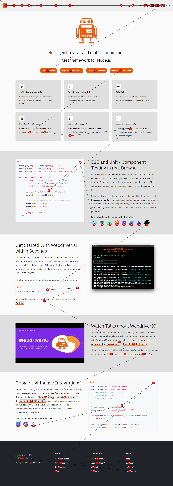

import Tabs from '@theme/Tabs';
import TabItem from '@theme/TabItem';

## What can it do?

WebdriverIO provides image comparisons on screens, elements or a full-page for browsers, mobile browsers as well as hybrid apps through the [`@wdio/visual-service`](https://www.npmjs.com/package/@wdio/visual-service) which is a lightweight WebdriverIO service.

This allows you to:

-   save or compare screens/elements/full-page screens against a baseline
-   automatically create a baseline when no baseline is there
-   block out custom regions and even automatically exclude a status and or toolbars (mobile only) during a comparison
-   increase the element dimensions screenshots
-   use different comparison methods
-   You can now verify how your website will support tabbing with your keyboard, see also [Tabbing through a website](#tabbing-through-a-website)
-   and much more, see the [service](./visual-testing/service-options) and [method](./visual-testing/method-options) options

The service is a lightweight module to retrieve the needed data and screenshots for all browsers/devices. The comparison power comes from [ResembleJS](https://github.com/Huddle/Resemble.js). If you want to compare images online you can check the [online tool](http://rsmbl.github.io/Resemble.js/).

It can be used for:

-   🖥️ Desktop browsers (Chrome / Firefox / Safari / Microsoft Edge)
-   📱 Mobile / Tablet browsers (Chrome / Safari on emulators / real devices) via Appium
-   📳 Hybrid apps via Appium

:::info NOTE For Hybrid Apps
Please use the property `isHybridApp:true` in your service settings
:::

## Installation

The easiest way is to keep `@wdio/visual-service` as a dev-dependency in your `package.json`, via:

```sh
npm install --save-dev @wdio/visual-service
```

## Usage

`@wdio/visual-service` can be used as a normal service. You can set it up in your configuration file with the following:

```js
import path from 'node:path'

// wdio.conf.ts
export const config = {
    // ...
    // =====
    // Setup
    // =====
    services: [
        ['visual', {
            // Some options, see the docs for more
            baselineFolder: path.join(process.cwd(), 'tests', 'baseline'),
            formatImageName: '{tag}-{logName}-{width}x{height}',
            screenshotPath: path.join(process.cwd(), 'tmp'),
            savePerInstance: true,
            autoSaveBaseline: true,
            blockOutStatusBar: true,
            blockOutToolBar: true,
            // NOTE: When you are testing a hybrid app please use this setting
            isHybridApp: true,
            // Options for the tabbing image
            tabbableOptions: {
                circle: {
                    size: 18,
                    fontSize: 18,
                    // ...
                },
                line: {
                    color: "#ff221a", // hex-code or for example words like `red|black|green`
                    width: 3,
                },
            },
            // ... more options
        }]
    ]
    // ...
}
```

More service options can be found [here](./service-options). Once set-up in your WebdriverIO configuration you can go ahead and add visual assertions to [your tests](/docs/visual-testing/writing-tests).

### WebdriverIO MultiRemote

We also support [MultiRemote](https://webdriver.io/docs/multiremote/). To make this work properly make sure that you add `wdio-ics:options` to your
capabilities as you can see below. This will make sure that each screenshot will have its own unique name.

[Writing your tests](/docs/visual-testing/writing-tests) will not be any different in comparison to using the [testrunner](https://webdriver.io/docs/testrunner)

```js
// wdio.conf.js
export const config = {
    capabilities: {
        chromeBrowserOne: {
            capabilities: {
                browserName: 'chrome',
                'goog:chromeOptions': {
                    args: ['disable-infobars'],
                },
                // THIS!!!
                'wdio-ics:options': {
                    logName: 'chrome-latest-one',
                }
            }
        },
        chromeBrowserTwo: {
            capabilities: {
                browserName: 'chrome',
                'goog:chromeOptions': {
                    args: ['disable-infobars'],
                },
                // THIS!!!
                'wdio-ics:options': {
                    logName: 'chrome-latest-two',
                }
            }
        }
    }
}
```

### Running Programmatically

Here is a minimal example of how to use `@wdio/visual-service` via `remote` options:

```js
import { remote } from 'webdriverio'
import VisualService from '@wdio/visual-service'

let visualService = new VisualService({
    autoSaveBaseline: true
})

const browser = await remote({
    logLevel: 'silent',
    capabilities: {
        browserName: 'chrome',
    }
})

visualService.before(browser.capabilities)
await browser.url('https://webdriver.io/')

// or use this for ONLY saving a screenshot
await browser.saveFullPageScreen('examplePaged', {})

// or use this for validating. Both methods don't need to be combined, see the FAQ
await browser.checkFullPageScreen('examplePaged', {})

await browser.deleteSession()
```

### Tabbing through a website

You can check if a website is accessible by using the keyboard <kbd>TAB</kbd>-key. Testing this part of accessibility has always been a time-consuming (manual) job and pretty hard to do through automation.
With the methods `saveTabbablePage` and `checkTabbablePage` you can now draw lines and dots on your website to verify the tabbing order.

Be aware of the fact that this is only useful for desktop browsers and **NOT**** for mobile devices. All desktop browsers support this feature.

:::note

The work is inspired by [Viv Richards](https://github.com/vivrichards600) his blog post about ["AUTOMATING PAGE TABABILITY (IS THAT A WORD?) WITH VISUAL TESTING"](https://vivrichards.co.uk/accessibility/automating-page-tab-flows-using-visual-testing-and-javascript).

The way tabbable elements are selected is based on the module [tabbable](https://github.com/davidtheclark/tabbable). If there are any issues regarding the tabbing please check the [README.md](https://github.com/davidtheclark/tabbable/blob/master/README.md) and especially the [More ](https://github.com/davidtheclark/tabbable/blob/master/README.md#more-details)Details section.

:::

#### How does it work

Both methods will create a `canvas` element on your website and draw lines and dots to show you where your TAB would go if an end-user would use it. After that, it will create a full-page screenshot to give you a good overview of the flow.

:::important

**Use the `saveTabbablePage` only when you need to create a screenshot and DON'T want to compare it **with a **baseline** image.****

:::

When you want to compare the tabbing flow with a baseline, then you can use the `checkTabbablePage`-method. You **DON'T** need to use the two methods together. If there is already a baseline image created, which can automatically be done by providing `autoSaveBaseline: true` when you instantiate the service,
the `checkTabbablePage` will first create the _actual_ image and then compare it against the baseline.

##### Options

Both methods use the same options as the [`saveFullPageScreen`](https://github.com/wswebcreation/webdriver-image-comparison/blob/master/docs/OPTIONS.md#savefullpagescreen-or-savetabbablepage) or the
[`compareFullPageScreen`](https://github.com/wswebcreation/webdriver-image-comparison/blob/master/docs/OPTIONS.md#comparefullpagescreen-or-comparetabbablepage).

#### Example

This is an example of how the tabbing works on our [guinea pig](http://guinea-pig.webdriver.io/image-compare.html) website](http://guinea-pig.webdriver.io/image-compare.html):



## Typescript support

We now also support typescript types. Add the following to the `types` in your `tsconfig.json`:

```json
{
    "compilerOptions": {
        "types": ["@wdio/visual-service"]
    }
}
```

## System Requirements

Aside from the general [project requirements](/gettingstarted#system-requirements) this module relies on [Canvas](https://github.com/Automattic/node-canvas) which is a canvas implementation for Node.js. It relies on [Cairo](https://cairographics.org/).

By default, binaries for macOS, Linux and Windows will be downloaded during your project's `npm install`. If you don't have a supported OS or processor architecture, the module will be compiled on your system. This requires several dependencies, including Cairo and Pango.

For detailed installation information, see the [node-canvas wiki](https://github.com/Automattic/node-canvas/wiki/_pages). One-line installation instructions for common OSes are below. Note that libgif/giflib, librsvg and libjpeg are optional and only required if you need GIF, SVG and JPEG support, respectively. Cairo v1.10.0 or later is required.

<Tabs
    defaultValue="osx"
    values={[
        {label: 'OS', value: 'osx'},
        {label: 'Ubuntu', value: 'ubuntu'},
        {label: 'Fedora', value: 'fedora'},
        {label: 'Solaris', value: 'solaris'},
        {label: 'OpenBSD', value: 'openbsd'},
        {label: 'Window', value: 'windows'},
        {label: 'Others', value: 'others'},
    ]}
>
<TabItem value="osx">

     Using [Homebrew](https://brew.sh/):

     ```sh
     brew install pkg-config cairo pango libpng jpeg giflib librsvg pixman
     ```

    **Mac OS X v10.11+:** If you have recently updated to Mac OS X v10.11+ and are experiencing trouble when compiling, run the following command: `xcode-select --install`. Read more about the problem [on Stack Overflow](http://stackoverflow.com/a/32929012/148072).
    If you have Xcode 10.0 or higher installed, to build from source you need NPM 6.4.1 or higher.

</TabItem>
<TabItem value="ubuntu">

    ```sh
    sudo apt-get install build-essential libcairo2-dev libpango1.0-dev libjpeg-dev libgif-dev librsvg2-dev
    ```

</TabItem>
<TabItem value="fedora">

    ```sh
    sudo yum install gcc-c++ cairo-devel pango-devel libjpeg-turbo-devel giflib-devel
    ```

</TabItem>
<TabItem value="solaris">

    ```sh
    pkgin install cairo pango pkg-config xproto renderproto kbproto xextproto
    ```

</TabItem>
<TabItem value="openbsd">

    ```sh
    doas pkg_add cairo pango png jpeg giflib
    ```

</TabItem>
<TabItem value="windows">

    See the [wiki](https://github.com/Automattic/node-canvas/wiki/Installation:-Windows)

</TabItem>
<TabItem value="others">

    See the [wiki](https://github.com/Automattic/node-canvas/wiki)

</TabItem>
</Tabs>
