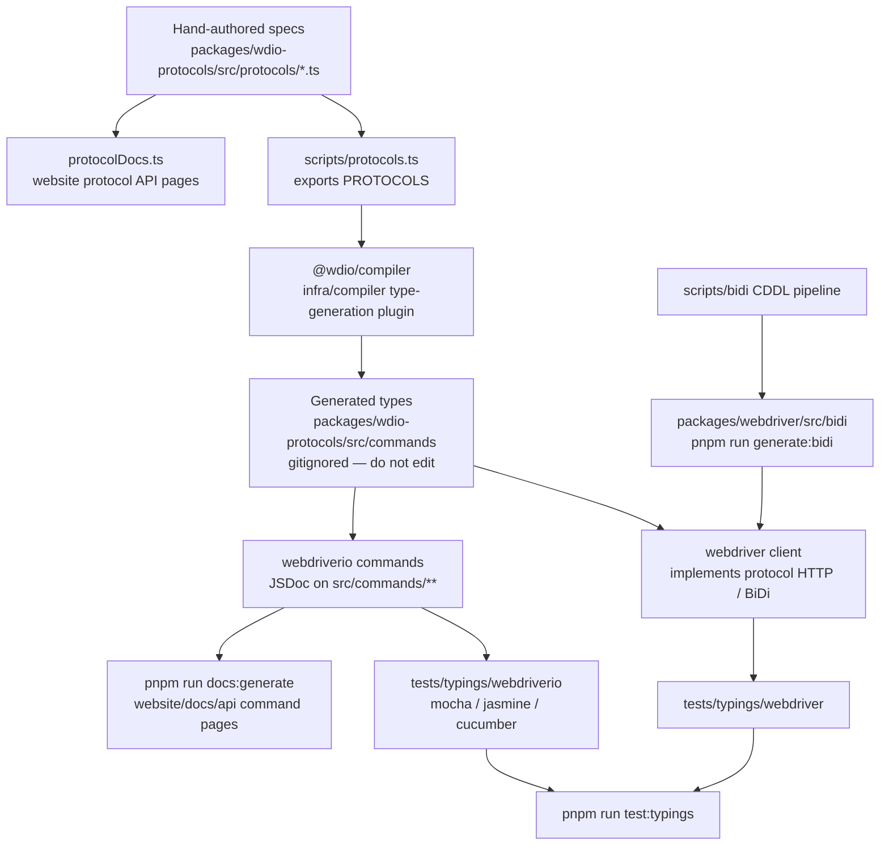

How protocol specs become TypeScript types, typings tests, and API docs.
Agents: do not hand-edit generated files — change the source in this chart
and regenerate.

## What to edit

| You want to change | Edit this | Then run |
|--------------------|-----------|----------|
| A WebDriver / Appium / vendor command shape | `packages/wdio-protocols/src/protocols/*.ts` | `pnpm run compile:all` and `pnpm run test:typings:webdriver` |
| A user-facing `browser.*` / `$().*` command | `packages/webdriverio/src/commands/**` plus its unit test and typings snippet | `pnpm run test:package webdriverio` and `pnpm run test:typings:webdriverio` |
| BiDi types | `scripts/bidi/` | `pnpm run generate:bidi` |
| Command API docs text | JSDoc on the webdriverio command | `pnpm run docs:generate` |
| Protocol API docs text | the protocol spec `description` / `ref` | `pnpm run docs:generate` |

See also [High level overview](/docs/flowcharts/highleveloverview). Protocol specs are
owned by `packages/wdio-protocols`; the compiler plugin lives in
`infra/compiler/src/type-generation`.
